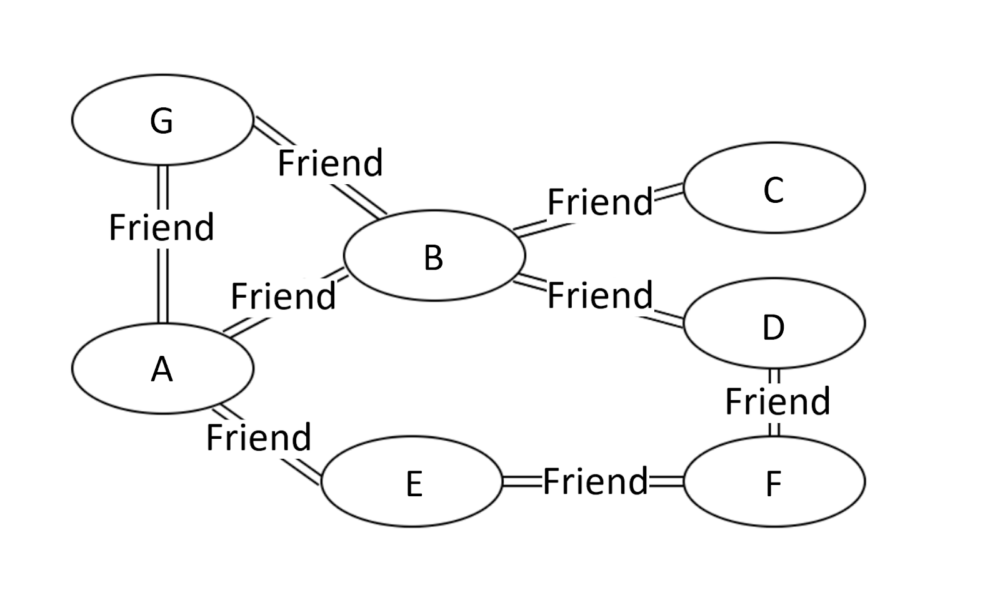
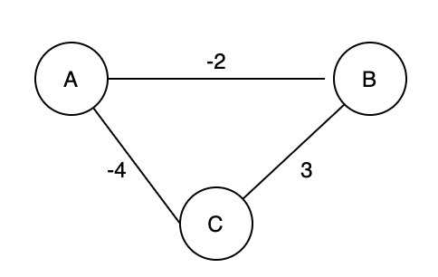
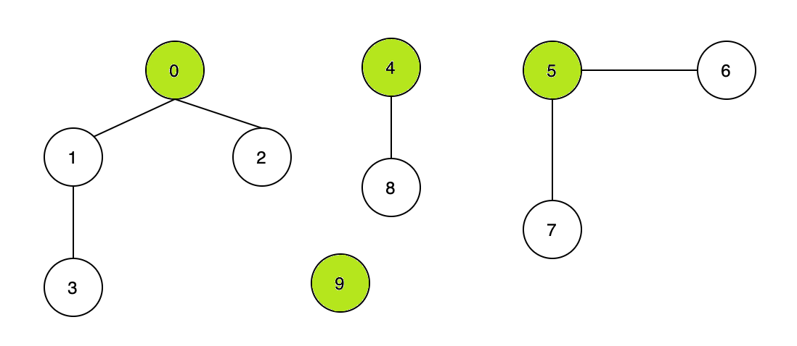
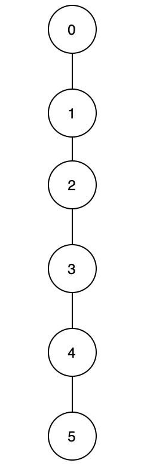
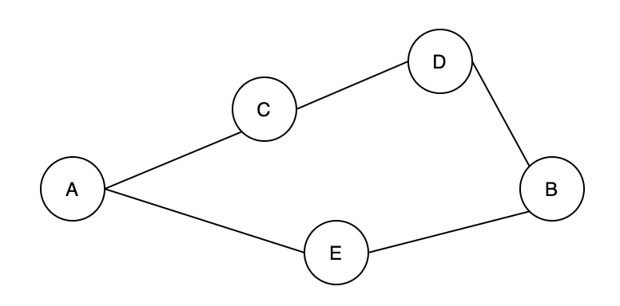
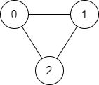
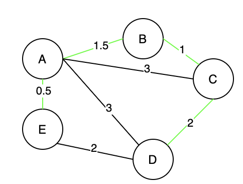
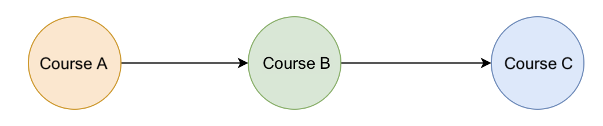

# Introduction

`Graph` is probably the data structure that has the closest resemblance to our daily life. There are many types of graphs describing the relationships in real life. For instance, our friend circle is a huge “graph”.



Figure 1. An example of a undirected graph.

In Figure 1 above, we can see that person G, B, and E are all direct friends of A, while person C, D, and F are indirect friends of A. This example is a social graph of friendship. So, what is the “graph” data structure?

## Types of “graphs”

There are many types of “graphs”. In this Explore Card, we will introduce three types of graphs: **undirected graphs, directed graphs, and weighted graphs.**

### Undirected graphs

The edges between any two vertices in an “undirected graph” do not have a direction, indicating a two-way relationship.

Figure 1 is an example of an undirected graph.

### Directed graphs

The edges between any two vertices in a “directed graph” graph are directional.

Figure 2 is an example of a directed graph.


Figure 2. An example of a directed graph.

### Weighted graphs

Each edge in a “weighted graph” has an associated weight. The weight can be of any metric, such as time, distance, size, etc. The most commonly seen “weighted map” in our daily life might be a city map. In Figure 3, each edge is marked with the distance, which can be regarded as the weight of that edge.


Figure 3. An example of a weighted graph.

## The Definition of “graph” and Terminologies

“Graph” is a non-linear data structure consisting of vertices and edges. There are a lot of terminologies to describe a graph. If you encounter an unfamiliar term in the following Explore Card, you may look up the definition below.

Vertex: In Figure 1, nodes such as A, B, and C are called vertices of the graph.

Edge: The connection between two vertices are the edges of the graph. In Figure 1, the connection between person A and B is an edge of the graph.

Path: the sequence of vertices to go through from one vertex to another. In Figure 1, a path from A to C is [A, B, C], or [A, G, B, C], or [A, E, F, D, B, C].

**Note**: there can be multiple paths between two vertices.

Path Length: the number of edges in a path. In Figure 1, the path lengths from person A to C are 2, 3, and 5, respectively.

Cycle: a path where the starting point and endpoint are the same vertex. In Figure 1, [A, B, D, F, E] forms a cycle. Similarly, [A, G, B] forms another cycle.

Negative Weight Cycle: In a “weighted graph”, if the sum of the weights of all edges of a cycle is a negative value, it is a negative weight cycle. In Figure 4, the sum of weights is -3.

Connectivity: if there exists at least one path between two vertices, these two vertices are connected. In Figure 1, A and C are connected because there is at least one path connecting them.

Degree of a Vertex: the term “degree” applies to unweighted graphs. The degree of a vertex is the number of edges connecting the vertex. In Figure 1, the degree of vertex A is 3 because three edges are connecting it.

In-Degree: “in-degree” is a concept in directed graphs. If the in-degree of a vertex is d, there are d directional edges incident to the vertex. In Figure 2, A’s indegree is 1, i.e., the edge from F to A.

Out-Degree: “out-degree” is a concept in directed graphs. If the out-degree of a vertex is d, there are d edges incident from the vertex. In Figure 2, A’s outdegree is 3, i,e, the edges A to B, A to C, and A to G.




Figure 4. An example of a negative weight cycle.


After understanding the basics of “graph”, let’s start our journey on learning data structures and algorithms related to “graph”.

# Disjoint Set

## Overview of Disjoint Set

Given the vertices and edges between them, how could we quickly check whether two vertices are connected? For example, Figure 5 shows the edges between vertices, so how can we efficiently check if 0 is connected to 3, 1 is connected to 5, or 7 is connected to 8? We can do so by using the “disjoint set” data structure, also known as the “union-find” data structure. Note that others might refer to it as an algorithm. In this Explore Card, the term “disjoint set” refers to a data structure.





Figure 5. Each graph consists of vertices and edges. The root vertices are in green

The primary use of disjoint sets is to address the connectivity between the components of a network. The “network“ here can be a computer network or a social network. For instance, we can use a disjoint set to determine if two people share a common ancestor.


### Terminologies

------

- Parent node: the direct parent node of a vertex. For example, in Figure 5, the parent node of vertex 3 is 1, the parent node of vertex 2 is 0, and the parent node of vertex 9 is 9.
- Root node: a node without a parent node; it can be viewed as the parent node of itself. For example, in Figure 5, the root node of vertices 3 and 2 is 0. As for 0, it is its own root node and parent node. Likewise, the root node and parent node of vertex 9 is 9 itself. Sometimes the root node is referred to as the head node.


### Introduction to Disjoint Sets

------

#### Summary of video content:

1. How do “disjoint sets” work.
2. Solving the connectivity question in Figure 5.

~~~
<iframe src="https://player.vimeo.com/video/584100211?badge=0&amp;autopause=0&amp;player_id=0&amp;app_id=58479&amp;h=f77988c39c" frameborder="0" allow="autoplay; fullscreen; picture-in-picture" allowfullscreen="" title="Introduction to Disjoint Sets" style="box-sizing: border-box; position: absolute; top: 0px; left: 0px; width: 800px; height: 450px;"></iframe>
~~~


### Implementing “disjoint sets”

------

#### Summary of video content:

1. How to implement a “disjoint set”.
2. The `find` function of a disjoint set.
3. The `union` function of a disjoint set.

~~~
<iframe src="https://player.vimeo.com/video/584099942?badge=0&amp;autopause=0&amp;player_id=0&amp;app_id=58479&amp;h=f77988c39c" frameborder="0" allow="autoplay; fullscreen; picture-in-picture" allowfullscreen="" title="Implementing Disjoint Sets" style="box-sizing: border-box; position: absolute; top: 0px; left: 0px; width: 800px; height: 450px;"></iframe>
~~~


### The two important functions of a “disjoint set.”

------

In the introduction videos above, we discussed the two important functions in a “disjoint set”.

- **The `find` function** finds the root node of a given vertex. For example, in Figure 5, the output of the find function for vertex 3 is 0.
- **The `union` function** unions two vertices and makes their root nodes the same. In Figure 5, if we union vertex 4 and vertex 5, their root node will become the same, which means the union function will modify the root node of vertex 4 or vertex 5 to the same root node.


### There are two ways to implement a “disjoint set”.

------

- Implementation with Quick Find: in this case, the time complexity of the `find` function will be $O(1)$. However, the `union` function will take more time with the time complexity of $O(N)$.
- Implementation with Quick Union: compared with the Quick Find implementation, the time complexity of the `union` function is better. Meanwhile, the `find` function will take more time in this case.


Next, we will learn these two implementations and two common strategies to optimize a disjoint set.


## Quick Find - Disjoint Set

### Explanation of Quick Find

------

In this video, we'll talk about Quick Find implementation of a Disjoint Set and cover its two basic operations along with their complexity: find and union.

~~~
<iframe src="https://player.vimeo.com/video/584099799?badge=0&amp;autopause=0&amp;player_id=0&amp;app_id=58479&amp;h=f77988c39c" frameborder="0" allow="autoplay; fullscreen; picture-in-picture" allowfullscreen="" title="Explanation of Quick Find Export v1" style="box-sizing: border-box; position: absolute; top: 0px; left: 0px; width: 800px; height: 450px;"></iframe>
~~~


### Algorithm

------

Here is a sample quick find implementation of the Disjoint Set.

~~~
<iframe src="https://leetcode.com/playground/CpvtEdFs/shared" frameborder="0" width="100%" height="500" name="CpvtEdFs" style="box-sizing: border-box; color: rgba(0, 0, 0, 0.65); font-family: -apple-system, BlinkMacSystemFont, &quot;Segoe UI&quot;, &quot;PingFang SC&quot;, &quot;Hiragino Sans GB&quot;, &quot;Microsoft YaHei&quot;, &quot;Helvetica Neue&quot;, Helvetica, Arial, sans-serif, &quot;Apple Color Emoji&quot;, &quot;Segoe UI Emoji&quot;, &quot;Segoe UI Symbol&quot;; font-size: 16px; font-style: normal; font-variant-ligatures: normal; font-variant-caps: normal; font-weight: 400; letter-spacing: normal; orphans: 2; text-align: start; text-indent: 0px; text-transform: none; white-space: normal; widows: 2; word-spacing: 0px; -webkit-text-stroke-width: 0px; text-decoration-thickness: initial; text-decoration-style: initial; text-decoration-color: initial;"></iframe>
~~~


### Time Complexity

------

|                     | Union-find Constructor | Find       | Union        | Connected  |
| ------------------- | ---------------------- | ---------- | ------------ | ---------- |
| **Time Complexity** | $O(N)$           | $O(1)$ | $O(N)$ | $O(1)$ |


Note: $N$ is the number of vertices in the graph.

- When initializing a `union-find constructor`, we need to create an array of size $N$ with the values equal to the corresponding array indices; this requires linear time.
- Each call to `find` will require $O(1)$ time since we are just accessing an element of the array at the given index.
- Each call to `union` will require $O(N)$ time because we need to traverse through the entire array and update the root vertices for all the vertices of the set that is going to be merged into another set.
- The `connected` operation takes $O(1)$ time since it involves the two `find` calls and the equality check operation.

### Space Complexity

------

We need $O(N)$ space to store the array of size $N$.

## Quick Union - Disjoint Set

### Explanation of Quick Union

------

In the following video we'll take a look at Quick Union implementation of a Disjoint Set and show the difference between the Quick Union implementation and the Quick Find implementation we talked about earlier. As previously done for the Quick Find implementation, we'll also derive the time complexity of the Quick Union operations so you can compare them.

~~~
<iframe src="https://player.vimeo.com/video/584099691?badge=0&amp;autopause=0&amp;player_id=0&amp;app_id=58479&amp;h=f77988c39c" frameborder="0" allow="autoplay; fullscreen; picture-in-picture" allowfullscreen="" title="Explanation of Quick Find Export v1" style="box-sizing: border-box; position: absolute; top: 0px; left: 0px; width: 800px; height: 450px;"></iframe>
~~~


### Why is Quick Union More Efficient than Quick Find?

------

Generally speaking, Quick Union is more efficient than Quick Find. We'll explain the reason in the below video.

~~~
<iframe src="https://player.vimeo.com/video/584100289?badge=0&amp;autopause=0&amp;player_id=0&amp;app_id=58479&amp;h=f77988c39c" frameborder="0" allow="autoplay; fullscreen; picture-in-picture" allowfullscreen="" title="Quick Union Explanation" style="box-sizing: border-box; position: absolute; top: 0px; left: 0px; width: 800px; height: 450px;"></iframe>
~~~

> Clarifying Notes

> The keen observer may notice that the Quick Union code shown here includes a soon-to-be introduced technique called path compression. While the complexity analysis in the video is sound, the correct Quick Union code (the right side of the video) is the implementation shown below.

### Algorithm

------

Here is a sample quick union implementation of the Disjoint Set.

~~~java
class UnionFind {
    private int[] root;

    public UnionFind(int size) {
        root = new int[size];
        for (int i = 0; i < size; i++) {
            root[i] = i;
        }
    }

    public int find(int x) {
        while (x != root[x]) {
            x = root[x];
        }
        return x;
    }

    public void union(int x, int y) {
        int rootX = find(x);
        int rootY = find(y);
        if (rootX != rootY) {
            root[rootY] = rootX;
        }
    }

    public boolean connected(int x, int y) {
        return find(x) == find(y);
    }
}

// App.java
// Test Case
public class App {
    public static void main(String[] args) throws Exception {
        UnionFind uf = new UnionFind(10);
        // 1-2-5-6-7 3-8-9 4
        uf.union(1, 2);
        uf.union(2, 5);
        uf.union(5, 6);
        uf.union(6, 7);
        uf.union(3, 8);
        uf.union(8, 9);
        System.out.println(uf.connected(1, 5)); // true
        System.out.println(uf.connected(5, 7)); // true
        System.out.println(uf.connected(4, 9)); // false
        // 1-2-5-6-7 3-8-9-4
        uf.union(9, 4);
        System.out.println(uf.connected(4, 9)); // true
    }
}
~~~

### Time Complexity

------

|                     | Union-find Constructor | Find         | Union        | Connected    |
| ------------------- | ---------------------- | ------------ | ------------ | ------------ |
| **Time Complexity** | $O(N)$           | $O(N)$ | $O(N)$ | $O(N)$ |


Note: $N$ is the number of vertices in the graph. In the worst-case scenario, the number of operations to get the root vertex will be $H$ where $H$ is the height of the tree. Because this implementation does not always point the root of the shorter tree to the root of the taller tree, $H$ can be at most $N$ when the tree forms a linked list.

- The same as in the quick find implementation, when initializing a `union-find constructor`, we need to create an array of size $N$ with the values equal to the corresponding array indices; this requires linear time.
- For the `find` operation, in the worst-case scenario, we need to traverse every vertex to find the root for the input vertex. The maximum number of operations to get the root vertex would be no more than the tree's height, so it will take $O(N)$ time.
- The `union` operation consists of two `find` operations which (**only in the worst-case**) will take $O(N)$ time, and two constant time operations, including the equality check and updating the array value at a given index. Therefore, the `union` operation also costs $O(N)$ in the worst-case.
- The `connected` operation also takes $O(N)$ time in the worst-case since it involves two `find` calls.

### Space Complexity

------

We need $O(N)$ space to store the array of size $N$.

## Union by Rank - Disjoint Set

### Disjoint Set - Union by Rank

------

We have implemented two kinds of “disjoint sets” so far, and they both have a concerning inefficiency. Specifically, the quick find implementation will always spend O(n) time on the union operation and in the quick union implementation, as shown in Figure 6, it is possible for all the vertices to form a line after connecting them using `union`, which results in the worst-case scenario for the `find` function. Is there any way to optimize these implementations?

Of course, there is; it is to union by rank. The word “rank” means ordering by specific criteria. Previously, for the `union` function, we always chose the root node of `x` and set it as the new root node for the other vertex. However, by choosing the parent node based on certain criteria (by rank), we can limit the maximum height of each vertex.

To be specific, the “rank” refers to the height of each vertex. When we `union` two vertices, instead of always picking the root of `x` (or `y`, it doesn't matter as long as we're consistent) as the new root node, we choose the root node of the vertex with a larger “rank”. We will merge the shorter tree under the taller tree and assign the root node of the taller tree as the root node for both vertices. In this way, we effectively avoid the possibility of connecting all vertices into a straight line. This optimization is called the “disjoint set” with union by rank.





Figure 6. A line graph


### Video Explanation

------

In this video, you'll learn how to actually implement the “disjoint set” with union by rank.

~~~
<iframe src="https://player.vimeo.com/video/584087188?badge=0&amp;autopause=0&amp;player_id=0&amp;app_id=58479&amp;h=f77988c39c" frameborder="0" allow="autoplay; fullscreen; picture-in-picture" allowfullscreen="" title="Union by Rank" style="box-sizing: border-box; position: absolute; top: 0px; left: 0px; width: 800px; height: 450px;"></iframe>
~~~

> Clarifying Notes

> At time 0:52 we have effectively constructed a linked list of nodes with 5 as the root node, where 4 points to 5, 3 to 4, 2 to 3, 1 to 2, and 0 to 1. This demonstrates the main inefficiency of Quick Union. A keen observer will notice that `union(x, y)` in our previous implementation of Quick Union, will always point `rootY` to `rootX`. So the actual order of operations to produce the "tree" shown at 0:52 would be `union(1, 0)`, `union(2, 0)`, `union(3, 0)`, `union(4, 0)`, `union(5, 0)`. Nevertheless, the key idea remains the same: Quick Union runs the risk of forming a skewed tree.

### Algorithm

------

Here is the sample implementation of union by rank.

~~~java
// UnionFind.class
class UnionFind {
    private int[] root;
    private int[] rank;

    public UnionFind(int size) {
        root = new int[size];
        rank = new int[size];
        for (int i = 0; i < size; i++) {
            root[i] = i;
            rank[i] = 1; 
        }
    }

    public int find(int x) {
        while (x != root[x]) {
            x = root[x];
        }
        return x;
    }

    public void union(int x, int y) {
        int rootX = find(x);
        int rootY = find(y);
        if (rootX != rootY) {
            if (rank[rootX] > rank[rootY]) {
                root[rootY] = rootX;
            } else if (rank[rootX] < rank[rootY]) {
                root[rootX] = rootY;
            } else {
                root[rootY] = rootX;
                rank[rootX] += 1;
            }
        }
    }

    public boolean connected(int x, int y) {
        return find(x) == find(y);
    }
}

// App.java
// Test Case
public class App {
    public static void main(String[] args) throws Exception {
        UnionFind uf = new UnionFind(10);
        // 1-2-5-6-7 3-8-9 4
        uf.union(1, 2);
        uf.union(2, 5);
        uf.union(5, 6);
        uf.union(6, 7);
        uf.union(3, 8);
        uf.union(8, 9);
        System.out.println(uf.connected(1, 5)); // true
        System.out.println(uf.connected(5, 7)); // true
        System.out.println(uf.connected(4, 9)); // false
        // 1-2-5-6-7 3-8-9-4
        uf.union(9, 4);
        System.out.println(uf.connected(4, 9)); // true
    }
}
~~~

### Time Complexity

------

|                     | Union-find Constructor | Find                 | Union                | Connected            |
| ------------------- | ---------------------- | -------------------- | -------------------- | -------------------- |
| **Time Complexity** | $O(N)$           | $O(logN)$ | $O(logN)$ | $O(logN)$ |


Note: $N$ is the number of vertices in the graph.

- For the `union-find` constructor, we need to create two arrays of size $N$ each.
- For the `find` operation, in the worst-case scenario, when we repeatedly union components of equal rank, the tree height will be at most \log(N) + 1log(*N*)+1, so the `find` operation requires $O(logN)$ time.
- For the `union` and `connected` operations, we also need $O(logN)$ time since these operations are dominated by the `find` operation.

### Space Complexity

------

We need $O(N)$ space to store the array of size $N$.


## Path Compression Optimization - Disjoint Set

### Path Compression Optimization - Disjoint Sets

------

In the previous implementation of the “disjoint set”, notice that to find the root node, we need to traverse the parent nodes sequentially until we reach the root node. If we search the root node of the same element again, we repeat the same operations. Is there any way to optimize this process?

The answer is yes! After finding the root node, we can update the parent node of all traversed elements to their root node. When we search for the root node of the same element again, we only need to traverse two elements to find its root node, which is highly efficient. So, how could we efficiently update the parent nodes of all traversed elements to the root node? The answer is to use “recursion”. This optimization is called “path compression”, which optimizes the `find` function.


### Video Explanation

------

In this video, we'll talk about how the “path compression” optimization is implemented.

~~~
<iframe src="https://player.vimeo.com/video/585017582?badge=0&amp;autopause=0&amp;player_id=0&amp;app_id=58479&amp;h=f77988c39c" frameborder="0" allow="autoplay; fullscreen; picture-in-picture" allowfullscreen="" title="Path Compression Optimization" style="box-sizing: border-box; position: absolute; top: 0px; left: 0px; width: 800px; height: 450px;"></iframe>
~~~

> Clarifying Notes

> At 3:17, in the `union` function, the line `root[rootY] = x;` should be `root[rootY] = rootX;` as shown in the code below.

### Algorithm

------

Here is the sample implementation of Path Compression.

~~~java
// UnionFind.class
class UnionFind {
    private int[] root;

    public UnionFind(int size) {
        root = new int[size];
        for (int i = 0; i < size; i++) {
            root[i] = i;
        }
    }

    public int find(int x) {
        if (x == root[x]) {
            return x;
        }
        return root[x] = find(root[x]);
    }

    public void union(int x, int y) {
        int rootX = find(x);
        int rootY = find(y);
        if (rootX != rootY) {
            root[rootY] = rootX;
        }
    }

    public boolean connected(int x, int y) {
        return find(x) == find(y);
    }
}

// App.java
// Test Case
public class App {
    public static void main(String[] args) throws Exception {
        UnionFind uf = new UnionFind(10);
        // 1-2-5-6-7 3-8-9 4
        uf.union(1, 2);
        uf.union(2, 5);
        uf.union(5, 6);
        uf.union(6, 7);
        uf.union(3, 8);
        uf.union(8, 9);
        System.out.println(uf.connected(1, 5)); // true
        System.out.println(uf.connected(5, 7)); // true
        System.out.println(uf.connected(4, 9)); // false
        // 1-2-5-6-7 3-8-9-4
        uf.union(9, 4);
        System.out.println(uf.connected(4, 9)); // true
    }
}
~~~

### Time Complexity

------

Time complexities shown below are for the average case, since the worst-case scenario is rare in practice.

|                     | Union-find Constructor | Find                 | Union                | Connected            |
| ------------------- | ---------------------- | -------------------- | -------------------- | -------------------- |
| **Time Complexity** | $O(N)$           | $O(logN)$ | $O(logN)$ | $O(logN)$ |


Note: $N$ is the number of vertices in the graph.

- As before, we need $O(N)$ time to create and fill the `root` array.
- For the `find`, `union`, and `connected` operations (the latter two operations both depend on the `find` operation), we need $O(1)$ time for the best case (when the parent node for some vertex is the root node itself). In the worst case, it would be $O(N)$ time when the tree is skewed. However, on average, the time complexity will be $O(logN)$. Supporting details for the average time complexity can be found in [Top-Down Analysis of Path Compression](https://www.cs.tau.ac.il/~michas/ufind.pdf) where R. Seidel and M. Sharir discuss the upper bound running time when path compression is used with arbitrary linking.

### Space Complexity

------

We need $O(N)$ space to store the array of size $N$.

## Optimized “disjoint set” with Path Compression and Union by Rank

### Optimized “disjoint set” with Path Compression and Union by Rank

------

This implementation of the “disjoint set” is optimized with both “path compression” and “union by rank”.


### Implementation

~~~
// UnionFind.class
class UnionFind {
    private int[] root;
    // Use a rank array to record the height of each vertex, i.e., the "rank" of each vertex.
    private int[] rank;

    public UnionFind(int size) {
        root = new int[size];
        rank = new int[size];
        for (int i = 0; i < size; i++) {
            root[i] = i;
            rank[i] = 1; // The initial "rank" of each vertex is 1, because each of them is
                         // a standalone vertex with no connection to other vertices.
        }
    }

	// The find function here is the same as that in the disjoint set with path compression.
    public int find(int x) {
        if (x == root[x]) {
            return x;
        }
        return root[x] = find(root[x]);
    }

	// The union function with union by rank
    public void union(int x, int y) {
        int rootX = find(x);
        int rootY = find(y);
        if (rootX != rootY) {
            if (rank[rootX] > rank[rootY]) {
                root[rootY] = rootX;
            } else if (rank[rootX] < rank[rootY]) {
                root[rootX] = rootY;
            } else {
                root[rootY] = rootX;
                rank[rootX] += 1;
            }
        }
    }

    public boolean connected(int x, int y) {
        return find(x) == find(y);
    }
}

// App.java
// Test Case
public class App {
    public static void main(String[] args) throws Exception {
        UnionFind uf = new UnionFind(10);
        // 1-2-5-6-7 3-8-9 4
        uf.union(1, 2);
        uf.union(2, 5);
        uf.union(5, 6);
        uf.union(6, 7);
        uf.union(3, 8);
        uf.union(8, 9);
        System.out.println(uf.connected(1, 5)); // true
        System.out.println(uf.connected(5, 7)); // true
        System.out.println(uf.connected(4, 9)); // false
        // 1-2-5-6-7 3-8-9-4
        uf.union(9, 4);
        System.out.println(uf.connected(4, 9)); // true
    }
}
~~~

### Time Complexity

------

|                     | Union-find Constructor | Find                       | Union                      | Connected                  |
| ------------------- | ---------------------- | -------------------------- | -------------------------- | -------------------------- |
| **Time Complexity** | $O(N)$           | $O(α(N))$ | $O(α(N))$ | $O(α(N))$ |


Note: $N$ is the number of vertices in the graph. \alpha*α* refers to the Inverse Ackermann function. In practice, we assume it's a constant. In other words, $O(α(N))$ is regarded as $O(1)$ on average.

- For the `union-find` constructor, we need to create two arrays of size $N$ each.
- When using the combination of union by rank and the path compression optimization, the `find` operation will take $O(α(N))$ time on average. Since `union` and `connected` both make calls to `find` and all other operations require constant time, `union` and `connected` functions will also take $O(α(N))$ time on average.

### Space Complexity

------

We need $O(N)$ space to store the array of size $N$.

## Summary of the “disjoint set” data structure

The main idea of a “disjoint set” is to have all connected vertices have the same parent node or root node, whether directly or indirectly connected. To check if two vertices are connected, we only need to check if they have the same root node.

The two most important functions for the “disjoint set” data structure are the `find` function and the `union` function. The `find` function locates the root node of a given vertex. The `union` function connects two previously unconnected vertices by giving them the same root node. There is another important function named `connected`, which checks the “connectivity” of two vertices. The `find` and `union` functions are essential for any question that uses the “disjoint set” data structure.


### Implementation of the “disjoint set”

~~~java
public class UnionFind {
    // Constructor of Union-find. The size is the length of the root array.
    public UnionFind(int size) {}
    public int find(int x) {}
    public void union(int x, int y) {}
    public boolean connected(int x, int y) {}
}
~~~

#### find function of the “disjoint set”

------

The “disjoint set” mainly uses the `find` function to find the root node of a given vertex.

- A basic implementation of the `find` function:

~~~java
public int find(int x) {
    while (x != root[x]) {
        x = root[x];
    }
    return x;
}
~~~

- The `find` function – optimized with path compression:

~~~java
public int find(int x) {
    if (x == root[x]) {
        return x;
    }
    return root[x] = find(root[x]);
}
~~~

#### union function of the “disjoint set”

------

The “disjoint set” mainly uses the `union` function to connect two vertices, `x`, and `y`, by equating their root node.

- A basic implementation of the `union` function:

  ~~~java
  public void union(int x, int y) {
      int rootX = find(x);
      int rootY = find(y);
      if (rootX != rootY) {
          root[rootY] = rootX;
      }
  }
  ~~~

- The `union` function – Optimized by union by rank:

~~~java
public void union(int x, int y) {
    int rootX = find(x);
    int rootY = find(y);
    if (rootX != rootY) {
        if (rank[rootX] > rank[rootY]) {
            root[rootY] = rootX;
        } else if (rank[rootX] < rank[rootY]) {
            root[rootX] = rootY;
        } else {
            root[rootY] = rootX;
            rank[rootX] += 1;
        }
    }
}
~~~

#### connected function of the “disjoint set”

------

The connected function checks if two vertices, `x` and `y`, are connected by checking if they have the same root node. If `x` and `y` have the same root node, they are connected. Otherwise, they are not connected.

~~~java
public boolean connected(int x, int y) {
    return find(x) == find(y);
}
~~~

### Tips for using the “disjoint sets” data structure in solving LeetCode problems

------

The code for the disjoint set is highly modularized. You might want to become familiar with the implementation. I would highly recommend that you understand and memorize the implementation of “disjoint set with path compression and union by rank”.

Finally, we strongly encourage you to solve the exercise problems using the abovementioned implementation of the “disjoint set” data structure. Some of these problems can be solved using other data structures and algorithms, but we highly recommend that you practice solving them using the “disjoint set” data structure.

## Coding Question - Number of Provinces

There are `n` cities. Some of them are connected, while some are not. If city `a` is connected directly with city `b`, and city `b` is connected directly with city `c`, then city `a` is connected indirectly with city `c`.

A **province** is a group of directly or indirectly connected cities and no other cities outside of the group.

You are given an `n x n` matrix `isConnected` where `isConnected[i][j] = 1` if the `ith` city and the `jth` city are directly connected, and `isConnected[i][j] = 0` otherwise.

Return *the total number of **provinces***.

 

**Example 1:**


```
Input: isConnected = [[1,1,0],[1,1,0],[0,0,1]]
Output: 2
```

**Example 2:**


```
Input: isConnected = [[1,0,0],[0,1,0],[0,0,1]]
Output: 3
```

 

**Constraints:**

- `1 <= n <= 200`
- `n == isConnected.length`
- `n == isConnected[i].length`
- `isConnected[i][j]` is `1` or `0`.
- `isConnected[i][i] == 1`
- `isConnected[i][j] == isConnected[j][i]`

~~~java
class Solution {
    public int findCircleNum(int[][] isConnected) {
        
    }
}
~~~

## LeetCode 547 - Number of Provinces - Disjoint Sets

### Video Solution

------

In this video, we'll show how to solve the Number of Provinces problem using a Disjoint Set.

~~~
<iframe src="https://player.vimeo.com/video/585691963?badge=0&amp;autopause=0&amp;player_id=0&amp;app_id=58479&amp;h=f77988c39c" frameborder="0" allow="autoplay; fullscreen; picture-in-picture" allowfullscreen="" title="LC 547 Disjoint Sets" style="box-sizing: border-box; position: absolute; top: 0px; left: 0px; width: 800px; height: 450px;"></iframe>
~~~


### Implementation

~~~java
class Solution {
    // Union Find
    public int findCircleNum(int[][] isConnected) {
        if (isConnected == null || isConnected.length == 0) {
            return 0;
        }

        int n = isConnected.length;
        UnionFind uf = new UnionFind(n);
        for (int i = 0; i < n; i++) {
            for (int j = 0; j < n; j++) {
                if (isConnected[i][j] == 1) {
                    uf.union(i, j);
                }
            }
        }

        return uf.getCount();
    }

    class UnionFind {
        private int[] root;
        private int[] rank;
        private int count;

        UnionFind(int size) {
            root = new int[size];
            rank = new int[size];
            count = size;
            for (int i = 0; i < size; i++) {
                root[i] = i;
                rank[i] = 1;
            }
        }

        int find(int x) {
            if (x == root[x]) {
                return x;
            }
            return root[x] = find(root[x]);
        }

        void union(int x, int y) {
            int rootX = find(x);
            int rootY = find(y);
            if (rootX != rootY) {
                if (rank[rootX] > rank[rootY]) {
                    root[rootY] = rootX;
                } else if (rank[rootX] < rank[rootY]) {
                    root[rootX] = rootY;
                } else {
                    root[rootY] = rootX;
                    rank[rootX] += 1;
                }
                count--;
            }
        }

        int getCount() {
            return count;
        }
    }
}
~~~

## Coding Question - Graph Valid Tree

Locked

## Coding Question - Number of Connected Co

Locked

## Coding Question - The Earliest Moment When

Locked

## Coding Question - Smallest String With Swaps

You are given a string `s`, and an array of pairs of indices in the string `pairs` where `pairs[i] = [a, b]` indicates 2 indices(0-indexed) of the string.

You can swap the characters at any pair of indices in the given `pairs` **any number of times**.

Return the lexicographically smallest string that `s` can be changed to after using the swaps.

 

**Example 1:**

```
Input: s = "dcab", pairs = [[0,3],[1,2]]
Output: "bacd"
Explaination: 
Swap s[0] and s[3], s = "bcad"
Swap s[1] and s[2], s = "bacd"
```

**Example 2:**

```
Input: s = "dcab", pairs = [[0,3],[1,2],[0,2]]
Output: "abcd"
Explaination: 
Swap s[0] and s[3], s = "bcad"
Swap s[0] and s[2], s = "acbd"
Swap s[1] and s[2], s = "abcd"
```

**Example 3:**

```
Input: s = "cba", pairs = [[0,1],[1,2]]
Output: "abc"
Explaination: 
Swap s[0] and s[1], s = "bca"
Swap s[1] and s[2], s = "bac"
Swap s[0] and s[1], s = "abc"
```

 

**Constraints:**

- `1 <= s.length <= 10^5`
- `0 <= pairs.length <= 10^5`
- `0 <= pairs[i][0], pairs[i][1] < s.length`
- `s` only contains lower case English letters.

>  Hide Hint #1 

> Think of it as a graph problem.

>  Hide Hint #2 

> Consider the pairs as connected nodes in the graph, what can you do with a connected component of indices ?

>  Hide Hint #3 

> We can sort each connected component alone to get the lexicographically minimum string.

~~~java
class Solution {
    public String smallestStringWithSwaps(String s, List<List<Integer>> pairs) {
        
    }
}
~~~

## Coding Question - Evaluate Division

You are given an array of variable pairs `equations` and an array of real numbers `values`, where `equations[i] = [Ai, Bi]` and `values[i]` represent the equation `Ai / Bi = values[i]`. Each `Ai` or `Bi` is a string that represents a single variable.

You are also given some `queries`, where `queries[j] = [Cj, Dj]` represents the `jth` query where you must find the answer for `Cj / Dj = ?`.

Return *the answers to all queries*. If a single answer cannot be determined, return `-1.0`.

**Note:** The input is always valid. You may assume that evaluating the queries will not result in division by zero and that there is no contradiction.

 

**Example 1:**

```
Input: equations = [["a","b"],["b","c"]], values = [2.0,3.0], queries = [["a","c"],["b","a"],["a","e"],["a","a"],["x","x"]]
Output: [6.00000,0.50000,-1.00000,1.00000,-1.00000]
Explanation: 
Given: a / b = 2.0, b / c = 3.0
queries are: a / c = ?, b / a = ?, a / e = ?, a / a = ?, x / x = ?
return: [6.0, 0.5, -1.0, 1.0, -1.0 ]
```

**Example 2:**

```
Input: equations = [["a","b"],["b","c"],["bc","cd"]], values = [1.5,2.5,5.0], queries = [["a","c"],["c","b"],["bc","cd"],["cd","bc"]]
Output: [3.75000,0.40000,5.00000,0.20000]
```

**Example 3:**

```
Input: equations = [["a","b"]], values = [0.5], queries = [["a","b"],["b","a"],["a","c"],["x","y"]]
Output: [0.50000,2.00000,-1.00000,-1.00000]
```

 

**Constraints:**

- `1 <= equations.length <= 20`
- `equations[i].length == 2`
- `1 <= Ai.length, Bi.length <= 5`
- `values.length == equations.length`
- `0.0 < values[i] <= 20.0`
- `1 <= queries.length <= 20`
- `queries[i].length == 2`
- `1 <= Cj.length, Dj.length <= 5`
- `Ai, Bi, Cj, Dj` consist of lower case English letters and digits.

> Hide Hint #1 
>
> Do you recognize this as a graph problem?

~~~java
class Solution {
    public double[] calcEquation(List<List<String>> equations, double[] values, List<List<String>> queries) {
        
    }
}
~~~

## Coding Question - Optimize Water Distribution

Locked

# The Depth-First Search Algorithm in Graph

## Overview of Depth-First Search Algorithm

Previously, we learned how to check the connectivity between two vertices with the “disjoint set” data structure. Now, let's switch gears and consider: Given a graph, how can we find all of its vertices, and how can we find all paths between two vertices?

The depth-first search algorithm is ideal in solving these kinds of problems because it can explore all paths from the start vertex to all other vertices. Let's start by considering an example. In Figure 7, there are five vertices `[A, C, D, B, E]`. Given two vertices `A` and `B`, there are two paths between them. One path is `[A, C, D, B]`, and the other is `[A, E, B]`.





Figure 7. An undirected graph

In Graph theory, the depth-first search algorithm (abbreviated as DFS) is mainly used to:

1. Traverse all vertices in a “graph”;
2. Traverse all paths between any two vertices in a “graph”.

## Traversing all Vertices – Depth-First Search Algorithm

### Video Introduction

------

In the following video, you'll learn how traversing all vertices in the graph can be done using a Depth-First Search (DFS) approach.

~~~
<iframe src="https://player.vimeo.com/video/584086713?badge=0&amp;autopause=0&amp;player_id=0&amp;app_id=58479&amp;h=f77988c39c" frameborder="0" allow="autoplay; fullscreen; picture-in-picture" allowfullscreen="" title="Traversing all vertices DFS" style="box-sizing: border-box; position: absolute; top: 0px; left: 0px; width: 800px; height: 450px;"></iframe>
~~~


### Complexity Analysis

------

- Time Complexity: O(V + E)*O*(*V*+*E*). Here, $V$ represents the number of vertices, and $E$ represents the number of edges. We need to check every vertex and traverse through every edge in the graph.
- Space Complexity: O(V)*O*(*V*). Either the manually created stack or the recursive call stack can store up to $V$ vertices.

## Traversing all paths between two vertices – Depth-First Search Algorithm

### Video Introduction

------

In the following video, we'll explain how to find all paths between two vertices using a Depth-First Search (DFS) approach.

~~~
<iframe src="https://player.vimeo.com/video/584099492?badge=0&amp;autopause=0&amp;player_id=0&amp;app_id=58479&amp;h=f77988c39c" frameborder="0" allow="autoplay; fullscreen; picture-in-picture" allowfullscreen="" title="Traversing all paths - DFS" style="box-sizing: border-box; position: absolute; top: 0px; left: 0px; width: 800px; height: 450px;"></iframe>
~~~

### Complexity Analysis

------

- Time Complexity: O((V - 1)!)*O*((*V*−1)!) The above example is for an undirected graph. The worst-case scenario, when trying to find all paths, is a complete graph. A complete graph is a graph where every vertex is connected to every other vertex.

In a complete graph, there will be V - 1*V*−1 unique paths of length one that start at the source vertex; one of these paths will go to the target and end. Each of the remaining paths will have V - 2*V*−2 unique paths that extend from it (since none of them will go back to the source vertex which was already visited). This process will continue and lead to approximately (V - 1)!(*V*−1)! total paths. Remember, once a path reaches the target vertex, it ends, so the total number of paths will be less than (V - 1)!(*V*−1)!.

The precise total number of paths in the worst-case scenario is equivalent to the [Number of Arrangements](https://oeis.org/wiki/Number_of_arrangements) of the subset of vertices excluding the source and target node, which equals $e⋅(V - 2)!$.

While finding all paths, at each iteration, we add all valid paths from the current vertex to the stack, as shown in the video. Each time we add a path to the stack requires O(V)*O*(*V*) time to create a copy of the current path, append a vertex to it, and push it onto the stack. Since the path grows by one vertex each time, a path of length $V$ must have been copied and pushed onto the stack $V$ times before reaching its current length. Therefore, it is intuitive to think that each path should require O(V^2)*O*(*V*2) time in total. However, there is a flaw in our logic. Consider the example above; at 2:50 we add `ADE` to the stack. Then at 3:20, we add `ADEC`, `ADEB`, and `ADEF` to the stack. `ADE` is a subpath of `ADEC`, `ADEB`, and `ADEF`, but `ADE` was only created once. So the time required for each path to create `ADE` can be thought of as O(V)*O*(*V*) divided by the number of paths that stem from `ADE`. With this in mind, the time spent to create a path is $V$ plus V - 1*V*−1 divided by the number of paths that stem from this subpath plus V - 2*V*−2 times... For a complete graph with many nodes, this averages out to $O(2⋅V) = O(V)$ time per path.

Thus, the time complexity to find all paths in an undirected graph in the worst-case scenario is equal to the number of paths found O((V - 2)!)*O*((*V*−2)!) times the average time to find a path O(V)*O*(*V*) which simplifies to O((V - 1)!)*O*((*V*−1)!).

- Space Complexity:

   

  O(V^3)*O*(*V*3)

  . The space used is by the stack which will contain:

  - (V - 1)(*V*−1) paths after adding first V - 1*V*−1 paths to the stack.
  - (V - 1) - 1 + (V - 2)(*V*−1)−1+(*V*−2) paths after popping one path and adding second set of paths.
  - (V - 1) - 1 + (V - 2) - 1 + (V - 3) - 1 + ...(*V*−1)−1+(*V*−2)−1+(*V*−3)−1+...
  - ≈ V \cdot (V - 1) / 2 + 1≈*V*⋅(*V*−1)/2+1 paths will be at most in the stack, and each path added to the stack will take O(V)*O*(*V*) space.

Therefore, in total, this solution will require O(V \cdot (V - 1) / 2 + 1) \cdot V = O(V^3)*O*(*V*⋅(*V*−1)/2+1)⋅*V*=*O*(*V*3) space. Note that the space used to store the result does not count towards the space complexity.

## Coding Question - Find if Path Exists in Graph

There is a **bi-directional** graph with `n` vertices, where each vertex is labeled from `0` to `n - 1` (**inclusive**). The edges in the graph are represented as a 2D integer array `edges`, where each `edges[i] = [ui, vi]` denotes a bi-directional edge between vertex `ui` and vertex `vi`. Every vertex pair is connected by **at most one** edge, and no vertex has an edge to itself.

You want to determine if there is a **valid path** that exists from vertex `source` to vertex `destination`.

Given `edges` and the integers `n`, `source`, and `destination`, return `true` *if there is a **valid path** from* `source` *to* `destination`*, or* `false` *otherwise**.*

 

**Example 1:**



```
Input: n = 3, edges = [[0,1],[1,2],[2,0]], source = 0, destination = 2
Output: true
Explanation: There are two paths from vertex 0 to vertex 2:
- 0 → 1 → 2
- 0 → 2
```

**Example 2:**


```
Input: n = 6, edges = [[0,1],[0,2],[3,5],[5,4],[4,3]], source = 0, destination = 5
Output: false
Explanation: There is no path from vertex 0 to vertex 5.
```

 

**Constraints:**

- `1 <= n <= 2 * 105`
- `0 <= edges.length <= 2 * 105`
- `edges[i].length == 2`
- `0 <= ui, vi <= n - 1`
- `ui != vi`
- `0 <= source, destination <= n - 1`
- There are no duplicate edges.
- There are no self edges.

~~~java
class Solution {
    public boolean validPath(int n, int[][] edges, int source, int destination) {
        
    }
}
~~~

## LeetCode 1971 - Find if Path Exists in Graph - DFS

### Video Solution

------

In this video solution, we'll use a DFS approach to solve the problem of finding whether a path exists from the source vertex to the target vertex on an undirected graph.

~~~
<iframe src="https://player.vimeo.com/video/632249939?badge=0&amp;autopause=0&amp;player_id=0&amp;app_id=58479&amp;h=408e02294a" frameborder="0" allow="autoplay; fullscreen; picture-in-picture" allowfullscreen="" title="LC 1971 DFS" style="box-sizing: border-box; position: absolute; top: 0px; left: 0px; width: 800px; height: 450px;"></iframe>
~~~


### Implementation

~~~java
class Solution {
    public boolean validPath(int n, int[][] edges, int start, int end) {
        List<List<Integer>> adjacency_list = new ArrayList<>();        
        for (int i = 0; i < n; i++) {
            adjacency_list.add(new ArrayList<>());
        }
        
        for (int[] edge : edges) {
            adjacency_list.get(edge[0]).add(edge[1]);
            adjacency_list.get(edge[1]).add(edge[0]);
        }
        
        Deque<Integer> stack = new ArrayDeque<>();
        stack.push(start);
        boolean seen[] = new boolean[n];
        Arrays.fill(seen, false);
        
        while (!stack.isEmpty()) {
            // Get the current node.
            int node = stack.pop();
            
            // Check if we have reached the target node.
            if (node == end) {
                return true;
            }
            
            // Check if we've already visited this node.
            if (seen[node]) {
                continue;
            }
            seen[node] = true;
            
            // Add all neighbors to the stack.
            for (int neighbor : adjacency_list.get(node)) {
                stack.push(neighbor);
            }
        }
        
        return false;
    }
}
~~~

### Complexity Analysis

------

- Time Complexity: O(V + E)*O*(*V*+*E*). Here, $V$ represents the number of vertices, and $E$ represents the number of edges.
  - To create the adjacency list, we must iterate over each of the $E$ edges.
  - In the while loop, at most, we will visit vertex once.
  - The for loop inside the while loop will have a cumulative sum of at most $E$ iterations since it will iterate over all of the node's neighbors for each node.
- Space Complexity: O(V + E)*O*(*V*+*E*).
  - The adjacency list will contain O(V + E)*O*(*V*+*E*) elements.
  - The stack will also contain O(E)*O*(*E*) elements. However, this can be reduced to O(V)*O*(*V*) by checking whether a `neighbor` node has been seen before adding it to the stack.
  - The `seen` set will use O(V)*O*(*V*) space to store the visited nodes.

## Coding Question - All Paths From Source to Target

Given a directed acyclic graph (**DAG**) of `n` nodes labeled from `0` to `n - 1`, find all possible paths from node `0` to node `n - 1` and return them in **any order**.

The graph is given as follows: `graph[i]` is a list of all nodes you can visit from node `i` (i.e., there is a directed edge from node `i` to node `graph[i][j]`).

 

**Example 1:**


```
Input: graph = [[1,2],[3],[3],[]]
Output: [[0,1,3],[0,2,3]]
Explanation: There are two paths: 0 -> 1 -> 3 and 0 -> 2 -> 3.
```

**Example 2:**


```
Input: graph = [[4,3,1],[3,2,4],[3],[4],[]]
Output: [[0,4],[0,3,4],[0,1,3,4],[0,1,2,3,4],[0,1,4]]
```

 

**Constraints:**

- `n == graph.length`
- `2 <= n <= 15`
- `0 <= graph[i][j] < n`
- `graph[i][j] != i` (i.e., there will be no self-loops).
- All the elements of `graph[i]` are **unique**.
- The input graph is **guaranteed** to be a **DAG**.


~~~java
class Solution {
    public List<List<Integer>> allPathsSourceTarget(int[][] graph) {
        
    }
}
~~~

## LeetCode 797 - All Paths From Source to Target - DFS

### Video Solution

------

In this video solution, we'll solve the problem of finding all paths from the source vertex to the target vertex on a directed acyclic graph (DAG) using a DFS approach. We'll take the All Paths From Source to Target problem as an example.

~~~
<iframe src="https://player.vimeo.com/video/585692137?badge=0&amp;autopause=0&amp;player_id=0&amp;app_id=58479&amp;h=f77988c39c" frameborder="0" allow="autoplay; fullscreen; picture-in-picture" allowfullscreen="" title="LC 797 DFS" style="box-sizing: border-box; position: absolute; top: 0px; left: 0px; width: 800px; height: 450px;"></iframe>
~~~

> Clarifying Notes
>
> Notice at time 1:02 that our graph only contains directed edges, and there are no cycles in the graph. This means that our graph is a directed acyclic graph (DAG). As specified in the problem description, it is guaranteed that our input will be a DAG. Just after 3:28 the video mentions that we do not need to record which nodes have been visited. This is because our given graph is a directed **acyclic** graph. The fact that the graph is guaranteed to be **acyclic** is a small but important distinction that allows us to not track which nodes have been visited.

### Implementation

~~~java
class Solution {
    // DFS
    public List<List<Integer>> allPathsSourceTarget(int[][] graph) {
        List<List<Integer>> paths = new ArrayList<>();
        if (graph == null || graph.length == 0) {
            return paths;
        }

        dfs(graph, 0, new ArrayList<>(), paths);
        return paths;
    }

    void dfs(int[][] graph, int node, List<Integer> path, List<List<Integer>> paths) {
        path.add(node);
        if (node == graph.length - 1) {
            paths.add(new ArrayList<>(path));
            return;
        }
        int[] nextNodes = graph[node];
        for (int nextNode: nextNodes) {
            dfs(graph, nextNode, path, paths);
            path.remove(path.size() - 1);
        }
    }
}
~~~

### Complexity Analysis

------

- Time Complexity: O(2^V \cdot V)*O*(2*V*⋅*V*). Here, $V$ represents the number of vertices.
  - For a directed acyclic graph (DAG) with $V$ vertices, there could be at most 2^{V - 1} - 12*V*−1−1 possible paths to go from the starting vertex to the target vertex. We need O(V)*O*(*V*) time to build each such path.
  - Therefore, a loose upper bound on the time complexity would be (2^{V - 1} - 1) \cdot O(V) = O(2^V \cdot V)(2*V*−1−1)⋅*O*(*V*)=*O*(2*V*⋅*V*).
  - Since we have overlap between the paths, the actual time spent on the traversal will be lower to some extent.
- Space Complexity: O(V)*O*(*V*). The recursion depth can be no more than $V$, and we need O(V)*O*(*V*) space to store all the previously visited vertices while recursively traversing deeper with the current path. Please note that we don't count the space usage for the output, i.e., to store all the paths we obtained.

## Coding Question - Clone Graph

Given a reference of a node in a **[connected](https://en.wikipedia.org/wiki/Connectivity_(graph_theory)#Connected_graph)** undirected graph.

Return a [**deep copy**](https://en.wikipedia.org/wiki/Object_copying#Deep_copy) (clone) of the graph.

Each node in the graph contains a value (`int`) and a list (`List[Node]`) of its neighbors.

```
class Node {
    public int val;
    public List<Node> neighbors;
}
```

 

**Test case format:**

For simplicity, each node's value is the same as the node's index (1-indexed). For example, the first node with `val == 1`, the second node with `val == 2`, and so on. The graph is represented in the test case using an adjacency list.

**An adjacency list** is a collection of unordered **lists** used to represent a finite graph. Each list describes the set of neighbors of a node in the graph.

The given node will always be the first node with `val = 1`. You must return the **copy of the given node** as a reference to the cloned graph.

 

**Example 1:**


```
Input: adjList = [[2,4],[1,3],[2,4],[1,3]]
Output: [[2,4],[1,3],[2,4],[1,3]]
Explanation: There are 4 nodes in the graph.
1st node (val = 1)'s neighbors are 2nd node (val = 2) and 4th node (val = 4).
2nd node (val = 2)'s neighbors are 1st node (val = 1) and 3rd node (val = 3).
3rd node (val = 3)'s neighbors are 2nd node (val = 2) and 4th node (val = 4).
4th node (val = 4)'s neighbors are 1st node (val = 1) and 3rd node (val = 3).
```

**Example 2:**


```
Input: adjList = [[]]
Output: [[]]
Explanation: Note that the input contains one empty list. The graph consists of only one node with val = 1 and it does not have any neighbors.
```

**Example 3:**

```
Input: adjList = []
Output: []
Explanation: This an empty graph, it does not have any nodes.
```

 

**Constraints:**

- The number of nodes in the graph is in the range `[0, 100]`.
- `1 <= Node.val <= 100`
- `Node.val` is unique for each node.
- There are no repeated edges and no self-loops in the graph.
- The Graph is connected and all nodes can be visited starting from the given node.

~~~java
/*
// Definition for a Node.
class Node {
    public int val;
    public List<Node> neighbors;
    public Node() {
        val = 0;
        neighbors = new ArrayList<Node>();
    }
    public Node(int _val) {
        val = _val;
        neighbors = new ArrayList<Node>();
    }
    public Node(int _val, ArrayList<Node> _neighbors) {
        val = _val;
        neighbors = _neighbors;
    }
}
*/

class Solution {
    public Node cloneGraph(Node node) {
        
    }
}
~~~


## Coding Question - Reconstruct Itinerary

You are given a list of airline `tickets` where `tickets[i] = [fromi, toi]` represent the departure and the arrival airports of one flight. Reconstruct the itinerary in order and return it.

All of the tickets belong to a man who departs from `"JFK"`, thus, the itinerary must begin with `"JFK"`. If there are multiple valid itineraries, you should return the itinerary that has the smallest lexical order when read as a single string.

- For example, the itinerary `["JFK", "LGA"]` has a smaller lexical order than `["JFK", "LGB"]`.

You may assume all tickets form at least one valid itinerary. You must use all the tickets once and only once.

 

**Example 1:**


```
Input: tickets = [["MUC","LHR"],["JFK","MUC"],["SFO","SJC"],["LHR","SFO"]]
Output: ["JFK","MUC","LHR","SFO","SJC"]
```

**Example 2:**


```
Input: tickets = [["JFK","SFO"],["JFK","ATL"],["SFO","ATL"],["ATL","JFK"],["ATL","SFO"]]
Output: ["JFK","ATL","JFK","SFO","ATL","SFO"]
Explanation: Another possible reconstruction is ["JFK","SFO","ATL","JFK","ATL","SFO"] but it is larger in lexical order.
```

 

**Constraints:**

- `1 <= tickets.length <= 300`
- `tickets[i].length == 2`
- `fromi.length == 3`
- `toi.length == 3`
- `fromi` and `toi` consist of uppercase English letters.
- `fromi != toi`

~~~java
class Solution {
    public List<String> findItinerary(List<List<String>> tickets) {
        
    }
}
~~~

## Coding Question - All Paths from Source Lead

Locked

# The Breadth-First Search Algorithm in Graph

## Overview of Breadth-First Search Algorithm

Previously, we discussed the “depth-first search” algorithm. This section will talk about a closely related and equally popular algorithm called “breadth-first search”. Similarly, the “breadth-first search” algorithm can traverse all vertices of a “graph” and traverse all paths between two vertices. However, the most advantageous use case of “breadth-first search” is to efficiently find the shortest path between two vertices in a “graph” where **all edges have equal and positive weights**.

Although the “depth-first search” algorithm can find the shortest path between two vertices in a “graph” with equal and positive weights, it must traverse all paths between two vertices before finding the shortest one. The “breadth-first search” algorithm, in most cases, can find the shortest path without traversing all paths. This is because when using "breadth-first search", as soon as a path between the source vertex and target vertex is found, it is guaranteed to be the shortest path between the two nodes.

In Figure 8, the vertices are `[A, C, D, B, E]`. Given vertices `A` and `B`, there are two paths between them. One path is `[A, C, D, B]`, and the other is `[A, E, B]`. Obviously, `[A, E, B]` is the shortest path between `A` and `B`.


Figure 8. An undirected graph

In Graph theory, the primary use cases of the “breadth-first search” (“BFS”) algorithm are:

1. Traversing all vertices in the “graph”;
2. Finding the shortest path between two vertices in a graph where **all edges have equal and positive weights**.

## Traversing all Vertices - Breadth-First Search

### Video Introduction

------

In the following video, we will demonstrate how to perform a graph traversal using a Breadth-First Search (BFS) approach.

~~~
<iframe src="https://player.vimeo.com/video/585693199?badge=0&amp;autopause=0&amp;player_id=0&amp;app_id=58479&amp;h=f77988c39c" frameborder="0" allow="autoplay; fullscreen; picture-in-picture" allowfullscreen="" title="Traversing all Vertices - BFS" style="box-sizing: border-box; position: absolute; top: 0px; left: 0px; width: 800px; height: 450px;"></iframe>
~~~


### Complexity Analysis

------

- Time Complexity: O(V + E)*O*(*V*+*E*). Here, $V$ represents the number of vertices, and $E$ represents the number of edges. We need to check every vertex and traverse through every edge in the graph. The time complexity is the same as it was for the DFS approach.
- Space Complexity: O(V)*O*(*V*). Generally, we will check if a vertex has been visited before adding it to the queue, so the queue will use at most O(V)*O*(*V*) space. Keeping track of which vertices have been visited will also require O(V)*O*(*V*) space.

## Shortest Path Between Two Vertices - Breadth-First Search

### Video Introduction

------

In the following video, we will discuss how to find the shortest path between two vertices using a Breadth-First Search (BFS).

~~~
<iframe src="https://player.vimeo.com/video/585017474?badge=0&amp;autopause=0&amp;player_id=0&amp;app_id=58479&amp;h=f77988c39c" frameborder="0" allow="autoplay; fullscreen; picture-in-picture" allowfullscreen="" title="Shortest Path Between 2 Vertices - BFS" style="box-sizing: border-box; position: absolute; top: 0px; left: 0px; width: 800px; height: 450px;"></iframe>
~~~


### Complexity Analysis

------

- Time Complexity: O(V + E)*O*(*V*+*E*). Here, $V$ represents the number of vertices, and $E$ represents the number of edges. In the worst case, when the distance between the starting vertex and the target vertex is the maximum possible, we need to check every vertex and traverse through every edge in the graph.
- Space Complexity: O(V)*O*(*V*). The queue will take up to O(V)*O*(*V*) space to store all the graph vertices in the worst-case scenario. We must also use O(V)*O*(*V*) space to keep track of which vertices have been visited.

## Coding Question - Find if Path Exists in Graph

There is a **bi-directional** graph with `n` vertices, where each vertex is labeled from `0` to `n - 1` (**inclusive**). The edges in the graph are represented as a 2D integer array `edges`, where each `edges[i] = [ui, vi]` denotes a bi-directional edge between vertex `ui` and vertex `vi`. Every vertex pair is connected by **at most one** edge, and no vertex has an edge to itself.

You want to determine if there is a **valid path** that exists from vertex `source` to vertex `destination`.

Given `edges` and the integers `n`, `source`, and `destination`, return `true` *if there is a **valid path** from* `source` *to* `destination`*, or* `false` *otherwise**.*

 

**Example 1:**


```
Input: n = 3, edges = [[0,1],[1,2],[2,0]], source = 0, destination = 2
Output: true
Explanation: There are two paths from vertex 0 to vertex 2:
- 0 → 1 → 2
- 0 → 2
```

**Example 2:**


```
Input: n = 6, edges = [[0,1],[0,2],[3,5],[5,4],[4,3]], source = 0, destination = 5
Output: false
Explanation: There is no path from vertex 0 to vertex 5.
```

 

**Constraints:**

- `1 <= n <= 2 * 105`
- `0 <= edges.length <= 2 * 105`
- `edges[i].length == 2`
- `0 <= ui, vi <= n - 1`
- `ui != vi`
- `0 <= source, destination <= n - 1`
- There are no duplicate edges.
- There are no self edges.

~~~
class Solution {
    public boolean validPath(int n, int[][] edges, int source, int destination) {
        
    }
}
~~~

## LeetCode 1971 - Find if Path Exists in Graph - BFS

### Video Solution

------

In this video solution, we'll use a BFS approach to solve the problem of finding whether a path exists from the source vertex to the target vertex on an undirected graph.

~~~
<iframe src="https://player.vimeo.com/video/632249734?badge=0&amp;autopause=0&amp;player_id=0&amp;app_id=58479&amp;h=a999d4b6bf" frameborder="0" allow="autoplay; fullscreen; picture-in-picture" allowfullscreen="" title="LC 1971 BFS" style="box-sizing: border-box; position: absolute; top: 0px; left: 0px; width: 800px; height: 450px;"></iframe>
~~~

### Implementation

~~~java
class Solution {
    public boolean validPath(int n, int[][] edges, int start, int end) {
        List<List<Integer>> adjacency_list = new ArrayList<>();        
        for (int i = 0; i < n; i++) {
            adjacency_list.add(new ArrayList<>());
        }
        
        for (int[] edge : edges) {
            adjacency_list.get(edge[0]).add(edge[1]);
            adjacency_list.get(edge[1]).add(edge[0]);
        }
        
        Queue<Integer> queue = new LinkedList<>();
        queue.add(start);
        boolean seen[] = new boolean[n];
        Arrays.fill(seen, false);
        seen[start] = true;
        
        while (!queue.isEmpty()) {
            // Get the current node.
            int node = queue.poll();
            
            // Check if we have reached the target node.
            if (node == end) {
                return true;
            }
            
            // Add all neighbors to the stack.
            for (int neighbor : adjacency_list.get(node)) {
                // Check if neighbor has been added to the queue before.
                if (!seen[neighbor]) {
                    seen[neighbor] = true;
                    queue.add(neighbor);
                }
            }
        }
        
        return false;
    }
}
~~~

### Complexity Analysis

------

- Time Complexity: O(V + E)*O*(*V*+*E*). Here, $V$ represents the number of vertices and $E$ represents the number of edges.
  - To create the adjacency list, we must iterate over each of the $E$ edges.
  - In the while loop, at most we will visit vertex once.
  - The for loop inside the while loop will have a cumulative sum of at most $E$ iterations since it will iterate over all of the node's neighbors for each node.
- Space Complexity: O(V + E)*O*(*V*+*E*).
  - The adjacency list, will contain O(V + E)*O*(*V*+*E*) elements.
  - The queue will also contain O(V)*O*(*V*) elements.
  - The `seen` set will use O(V)*O*(*V*) space to store the visited nodes.

## Coding Question - All Paths From Source to Target

Given a directed acyclic graph (**DAG**) of `n` nodes labeled from `0` to `n - 1`, find all possible paths from node `0` to node `n - 1` and return them in **any order**.

The graph is given as follows: `graph[i]` is a list of all nodes you can visit from node `i` (i.e., there is a directed edge from node `i` to node `graph[i][j]`).

 

**Example 1:**


```
Input: graph = [[1,2],[3],[3],[]]
Output: [[0,1,3],[0,2,3]]
Explanation: There are two paths: 0 -> 1 -> 3 and 0 -> 2 -> 3.
```

**Example 2:**


```
Input: graph = [[4,3,1],[3,2,4],[3],[4],[]]
Output: [[0,4],[0,3,4],[0,1,3,4],[0,1,2,3,4],[0,1,4]]
```

 

**Constraints:**

- `n == graph.length`
- `2 <= n <= 15`
- `0 <= graph[i][j] < n`
- `graph[i][j] != i` (i.e., there will be no self-loops).
- All the elements of `graph[i]` are **unique**.
- The input graph is **guaranteed** to be a **DAG**.

~~~java
class Solution {
    public List<List<Integer>> allPathsSourceTarget(int[][] graph) {
        
    }
}
~~~

## LeetCode 797 - All Paths From Source to Target - BFS

### Video Solution

------

In the following video, we'll solve the All Paths From Source to Target problem that we previously solved using DFS. However, this time we will use BFS to do so.

~~~
<iframe src="https://player.vimeo.com/video/585692073?badge=0&amp;autopause=0&amp;player_id=0&amp;app_id=58479&amp;h=f77988c39c" frameborder="0" allow="autoplay; fullscreen; picture-in-picture" allowfullscreen="" title="LC 797 BFS v2" style="box-sizing: border-box; position: absolute; top: 0px; left: 0px; width: 800px; height: 450px;"></iframe>
~~~

> Clarifying Notes
>
> Notice at time 0:42 that our graph only contains directed edges, and there are no cycles in the graph. This means that our graph is a directed acyclic graph (DAG). As specified in the problem description, it is guaranteed that our input will be a DAG. At time 3:25, the video mentions that we do not need to record which nodes have been visited. This is because our given graph is a directed **acyclic** graph. The fact that the graph is guaranteed to be **acyclic** is a small but important distinction that allows us to not track which nodes have been visited.

### Implementation

~~~java
class Solution {
    public List<List<Integer>> allPathsSourceTarget(int[][] graph) {
        List<List<Integer>> paths = new ArrayList<>();
        if (graph == null || graph.length == 0) {
            return paths;
        }

        Queue<List<Integer>> queue = new LinkedList<>();
        List<Integer> path = new ArrayList<>();
        path.add(0);
        queue.add(path);

        while (!queue.isEmpty()) {
            List<Integer> currentPath = queue.poll();
            int node = currentPath.get(currentPath.size() - 1);
            for (int nextNode: graph[node]) {
                List<Integer> tmpPath = new ArrayList<>(currentPath);
                tmpPath.add(nextNode);
                if (nextNode == graph.length - 1) {
                    paths.add(new ArrayList<>(tmpPath));
                } else {
                    queue.add(new ArrayList<>(tmpPath));
                } 
            }
        }
        return paths;
    }
}
~~~

### Complexity Analysis

------

- Time Complexity: O(2^V \cdot V)*O*(2*V*⋅*V*). Here, $V$ represents the number of vertices.
  - For a graph with $V$ vertices, there could be at most 2^{V - 1} - 12*V*−1−1 possible paths to go from the starting vertex to the target vertex. We need O(V)*O*(*V*) time to build each such path.
  - Therefore, a loose upper bound on the time complexity would be (2^{V - 1} - 1) \cdot O(V) = O(2^V \cdot V)(2*V*−1−1)⋅*O*(*V*)=*O*(2*V*⋅*V*).
  - Since we have overlapping between the paths, the actual time spent on the traversal will be lower to some extent.
- Space Complexity: O(2^V \cdot V)*O*(2*V*⋅*V*). The queue can contain O(2^V)*O*(2*V*) paths and each path will take O(V)*O*(*V*) space. Therefore, the overall space complexity is O(2^V \cdot V)*O*(2*V*⋅*V*).

## Coding Question - Populating Next Right Pointers in Each Node

You are given a **perfect binary tree** where all leaves are on the same level, and every parent has two children. The binary tree has the following definition:

```
struct Node {
  int val;
  Node *left;
  Node *right;
  Node *next;
}
```

Populate each next pointer to point to its next right node. If there is no next right node, the next pointer should be set to `NULL`.

Initially, all next pointers are set to `NULL`.

 

**Example 1:**


```
Input: root = [1,2,3,4,5,6,7]
Output: [1,#,2,3,#,4,5,6,7,#]
Explanation: Given the above perfect binary tree (Figure A), your function should populate each next pointer to point to its next right node, just like in Figure B. The serialized output is in level order as connected by the next pointers, with '#' signifying the end of each level.
```

**Example 2:**

```
Input: root = []
Output: []
```

 

**Constraints:**

- The number of nodes in the tree is in the range `[0, 212 - 1]`.
- `-1000 <= Node.val <= 1000`

 

**Follow-up:**

- You may only use constant extra space.
- The recursive approach is fine. You may assume implicit stack space does not count as extra space for this problem.

~~~java
/*
// Definition for a Node.
class Node {
    public int val;
    public Node left;
    public Node right;
    public Node next;

    public Node() {}
    
    public Node(int _val) {
        val = _val;
    }

    public Node(int _val, Node _left, Node _right, Node _next) {
        val = _val;
        left = _left;
        right = _right;
        next = _next;
    }
};
*/

class Solution {
    public Node connect(Node root) {
        
    }
}
~~~


## Coding Question - Shortest Path in Binary Matrix

Given an `n x n` binary matrix `grid`, return *the length of the shortest **clear path** in the matrix*. If there is no clear path, return `-1`.

A **clear path** in a binary matrix is a path from the **top-left** cell (i.e., `(0, 0)`) to the **bottom-right** cell (i.e., `(n - 1, n - 1)`) such that:

- All the visited cells of the path are `0`.
- All the adjacent cells of the path are **8-directionally** connected (i.e., they are different and they share an edge or a corner).

The **length of a clear path** is the number of visited cells of this path.

 

**Example 1:**


```
Input: grid = [[0,1],[1,0]]
Output: 2
```

**Example 2:**


```
Input: grid = [[0,0,0],[1,1,0],[1,1,0]]
Output: 4
```

**Example 3:**

```
Input: grid = [[1,0,0],[1,1,0],[1,1,0]]
Output: -1
```

 

**Constraints:**

- `n == grid.length`
- `n == grid[i].length`
- `1 <= n <= 100`
- `grid[i][j] is 0 or 1`

>  Hide Hint #1 
>
>  Do a breadth first search to find the shortest path.

~~~java
class Solution {
    public int shortestPathBinaryMatrix(int[][] grid) {
        
    }
}
~~~


## Coding Question - N-ary Tree Level Order Traversal

Given an n-ary tree, return the *level order* traversal of its nodes' values.

*Nary-Tree input serialization is represented in their level order traversal, each group of children is separated by the null value (See examples).*

 

**Example 1:**


```
Input: root = [1,null,3,2,4,null,5,6]
Output: [[1],[3,2,4],[5,6]]
```

**Example 2:**


```
Input: root = [1,null,2,3,4,5,null,null,6,7,null,8,null,9,10,null,null,11,null,12,null,13,null,null,14]
Output: [[1],[2,3,4,5],[6,7,8,9,10],[11,12,13],[14]]
```

 

**Constraints:**

- The height of the n-ary tree is less than or equal to `1000`
- The total number of nodes is between `[0, 104]`

~~~java
/*
// Definition for a Node.
class Node {
    public int val;
    public List<Node> children;

    public Node() {}

    public Node(int _val) {
        val = _val;
    }

    public Node(int _val, List<Node> _children) {
        val = _val;
        children = _children;
    }
};
*/

class Solution {
    public List<List<Integer>> levelOrder(Node root) {
        
    }
}
~~~

## Coding Question - Rotting Oranges

You are given an `m x n` `grid` where each cell can have one of three values:

- `0` representing an empty cell,
- `1` representing a fresh orange, or
- `2` representing a rotten orange.

Every minute, any fresh orange that is **4-directionally adjacent** to a rotten orange becomes rotten.

Return *the minimum number of minutes that must elapse until no cell has a fresh orange*. If *this is impossible, return* `-1`.

 

**Example 1:**


```
Input: grid = [[2,1,1],[1,1,0],[0,1,1]]
Output: 4
```

**Example 2:**

```
Input: grid = [[2,1,1],[0,1,1],[1,0,1]]
Output: -1
Explanation: The orange in the bottom left corner (row 2, column 0) is never rotten, because rotting only happens 4-directionally.
```

**Example 3:**

```
Input: grid = [[0,2]]
Output: 0
Explanation: Since there are already no fresh oranges at minute 0, the answer is just 0.
```

 

**Constraints:**

- `m == grid.length`
- `n == grid[i].length`
- `1 <= m, n <= 10`
- `grid[i][j]` is `0`, `1`, or `2`.

~~~java
class Solution {
    public int orangesRotting(int[][] grid) {
        
    }
}
~~~


# Algorithm to Construct Minimum Spanning Tree

## Overview of Minimum Spanning Tree

You might wonder: what is a spanning tree? A **spanning tree** is a connected subgraph in an undirected graph where **all vertices** are connected with the **minimum number** of edges. In Figure 9, all pink edges `[(A, B), (A, C), (A, D), (A, E)]` form a tree, which is a spanning tree of this undirected graph. Note that `[(A, E), (A, B), (B, C), (C, D)]` is also a spanning tree of the undirected graph. Thus, an “undirected graph” can have multiple spanning trees.


Figure 9. Spanning tree

After learning what a spanning tree is, you might have another question: what is a **minimum spanning tree**? A minimum spanning tree is a spanning tree with the minimum possible total edge weight in a “weighted undirected graph”. In Figure 10, a spanning tree formed by green edges `[(A, E), (A, B), (B, C), (C, D)]` is one of the minimum spanning trees in this weighted undirected graph. Actually, `[(A, E), (E, D), (A, B), (B, C)]` forms another minimum spanning tree of the weighted undirected graph. Thus, a “weighted undirected graph” can have multiple minimum spanning trees.





Figure 10. Minimum spanning tree

In this chapter, we will learn about the “cut property and two algorithms for constructing a “minimum spanning tree”:

- Kruskal’s Algorithm
- Prim’s algorithm

## Cut Property

What is a “cut”? Although many theorems are named after people’s names, “cut” is not one of them. To understand the “cut property”, we need to understand two basic concepts.

- First, in Graph theory, a “cut” is a partition of vertices in a “graph” into two disjoint subsets. Figure 11 illustrates a “cut”, where `(B, A, E)` forms one subset, and `(C, D)` forms the other subset.
- Second, a crossing edge is an edge that connects a vertex in one set with a vertex in the other set. In Figure 11, `(B, C)`, `(A, C)`, `(A, D)`, `(E, D)` are all “crossing edges”.


Figure 11. Graph with a cut

After knowing the basics of a graph cut, let’s delve into the “cut property”. The cut property provides theoretical support for Kruskal’s algorithm and Prim’s algorithm. So, what is the “cut property”? According to [Wikipedia](https://en.wikipedia.org/wiki/Minimum_spanning_tree#Cut_property), the “cut property” refers to:

> For any cut `C` of the graph, if the weight of an edge `E` in the cut-set of `C` is strictly smaller than the weights of all other edges of the cut-set of `C`, then this edge belongs to all MSTs of the graph.


### Proof of the Cut Property

------

In the following video, we'll explain and prove the “cut property”.

~~~
<iframe src="https://player.vimeo.com/video/584100413?badge=0&amp;autopause=0&amp;player_id=0&amp;app_id=58479&amp;h=f77988c39c" frameborder="0" allow="autoplay; fullscreen; picture-in-picture" allowfullscreen="" title="Proof of the Cut Property" style="box-sizing: border-box; color: rgba(0, 0, 0, 0.65); font-family: -apple-system, BlinkMacSystemFont, &quot;Segoe UI&quot;, &quot;PingFang SC&quot;, &quot;Hiragino Sans GB&quot;, &quot;Microsoft YaHei&quot;, &quot;Helvetica Neue&quot;, Helvetica, Arial, sans-serif, &quot;Apple Color Emoji&quot;, &quot;Segoe UI Emoji&quot;, &quot;Segoe UI Symbol&quot;; font-size: 16px; font-style: normal; font-variant-ligatures: normal; font-variant-caps: normal; font-weight: 400; letter-spacing: normal; orphans: 2; text-align: start; text-indent: 0px; text-transform: none; white-space: normal; widows: 2; word-spacing: 0px; -webkit-text-stroke-width: 0px; background-color: rgb(255, 255, 255); text-decoration-thickness: initial; text-decoration-style: initial; text-decoration-color: initial; position: absolute; top: 0px; left: 0px; width: 800px; height: 450px;"></iframe>
~~~

## Kruskal’s Algorithm

“Kruskal’s algorithm” is an algorithm to construct a “minimum spanning tree” of a “weighted undirected graph”.


### Video Explanation

------

The following video will introduce Kruskal’s Algorithm and show how it can be applied to construct a “minimum spanning tree” of a “weighted undirected graph”.

~~~
<iframe src="https://player.vimeo.com/video/585017148?badge=0&amp;autopause=0&amp;player_id=0&amp;app_id=58479&amp;h=f77988c39c" frameborder="0" allow="autoplay; fullscreen; picture-in-picture" allowfullscreen="" title="Kruskal&amp;#039;s Algorithm" style="box-sizing: border-box; position: absolute; top: 0px; left: 0px; width: 800px; height: 450px;"></iframe>
~~~


### Visual Example

------


The above animation shows how Kruskal's algorithm ***grows\*** the minimum spanning tree by adding edges. In this example, the distance between two vertices is the edge weight. We try adding each edge, one at a time, from the lowest weight edge up to the highest weight edge. If either of the edges' vertices is not already part of the MST, then the edge is added to the MST.


### Why does Kruskal’s Algorithm only choose N-1 edges?

------

In the following video, we'll prove that we need to choose exactly N-1*N*−1 edges of the graph with $N$ edges in total to construct a “minimum spanning tree” of that graph.

~~~
<iframe src="https://player.vimeo.com/video/585017108?badge=0&amp;autopause=0&amp;player_id=0&amp;app_id=58479&amp;h=f77988c39c" frameborder="0" allow="autoplay; fullscreen; picture-in-picture" allowfullscreen="" title="Why does Kruskal&amp;#039;s Algo only choose N-1 edges" style="box-sizing: border-box; position: absolute; top: 0px; left: 0px; width: 800px; height: 450px;"></iframe>
~~~


Please note that in the video above, all the graphs are linked lists. However, it's not necessary for a “minimum spanning tree” to be a linked list only. In other words, we can form an MST without forming a linked list. In any case, only `N-1` edges are needed.


### Why can we apply the “greedy strategy”?

------

In the subsequent video, you'll see why the greedy approach does work in accomplishing our task.

~~~
<iframe src="https://player.vimeo.com/video/585016911?badge=0&amp;autopause=0&amp;player_id=0&amp;app_id=58479&amp;h=f77988c39c" frameborder="0" allow="autoplay; fullscreen; picture-in-picture" allowfullscreen="" title="Proof of Kruskal&amp;#039;s Algo v2" style="box-sizing: border-box; position: absolute; top: 0px; left: 0px; width: 800px; height: 450px;"></iframe>
~~~


### Complexity Analysis

------

- Time Complexity: O(E \cdot \log E)*O*(*E*⋅log*E*). Here, $E$ represents the number of edges.
  - At first, we need to sort all the edges of the graph in ascending order. Sorting will take O(E \log E)*O*(*E*log*E*) time.
  - Next, we can start building our minimum spanning tree by selecting which edges should be included. For each edge, we will look at whether both of the vertices of the edge belong to the same connected component; which is an O(\alpha(V))*O*(*α*(*V*)) operation, where \alpha*α* refers to the Inverse Ackermann function. In the worst case, the tree will not be complete until we reach the very last edge (the edge with the largest weight), so this process will take O(E \alpha(V))*O*(*E**α*(*V*)) time.
  - Therefore, in total, the time complexity is O(E \log E + E \alpha(V)) = O(E \log E)*O*(*E*log*E*+*E**α*(*V*))=*O*(*E*log*E*).
- Space Complexity: O(V)*O*(*V*). $V$ represents the number of vertices. Keeping track of the root of every vertex in the union-find data structure requires O(V)*O*(*V*) space. However, depending on the sorting algorithm used, different amounts of auxiliary space will be required to sort the list of edges in place. For instance, Timsort (used by default in python) requires O(E)*O*(*E*) space in the worst-case scenario, while Java uses a variant of quicksort whose space complexity is O(\log E)*O*(log*E*).

## Coding Question - Min Cost to Connect All Points

You are given an array `points` representing integer coordinates of some points on a 2D-plane, where `points[i] = [xi, yi]`.

The cost of connecting two points `[xi, yi]` and `[xj, yj]` is the **manhattan distance** between them: `|xi - xj| + |yi - yj|`, where `|val|` denotes the absolute value of `val`.

Return *the minimum cost to make all points connected.* All points are connected if there is **exactly one** simple path between any two points.

 

**Example 1:**


```
Input: points = [[0,0],[2,2],[3,10],[5,2],[7,0]]
Output: 20
Explanation: 

We can connect the points as shown above to get the minimum cost of 20.
Notice that there is a unique path between every pair of points.
```

**Example 2:**

```
Input: points = [[3,12],[-2,5],[-4,1]]
Output: 18
```

 

**Constraints:**

- `1 <= points.length <= 1000`
- `-106 <= xi, yi <= 106`
- All pairs `(xi, yi)` are distinct.

>  Hide Hint #1 
>
>  Connect each pair of points with a weighted edge, the weight being the manhattan distance between those points.

>  Hide Hint #2 
>
>  The problem is now the cost of minimum spanning tree in graph with above edges.

~~~java
class Solution {
    public int minCostConnectPoints(int[][] points) {
        
    }
}
~~~

## LeetCode 1584 - Min Cost to Connect All Points - Kruskal's Algorithm

### Video Solution

------

In the following video, we'll approach the Min Cost to Connect All Points problem with Kruskal's Algorithm.

~~~
<iframe src="https://player.vimeo.com/video/585692266?badge=0&amp;autopause=0&amp;player_id=0&amp;app_id=58479&amp;h=f77988c39c" frameborder="0" allow="autoplay; fullscreen; picture-in-picture" allowfullscreen="" title="LC 1584 - Kruskal&amp;#039;s" style="box-sizing: border-box; position: absolute; top: 0px; left: 0px; width: 800px; height: 450px;"></iframe>
~~~

### Implementation

~~~java
class Solution {
    // Kruskal's Algorithm
    public int minCostConnectPoints(int[][] points) {
        if (points == null || points.length == 0) {
            return 0;
        }
        int size = points.length;
        PriorityQueue<Edge> pq = new PriorityQueue<>((x, y) -> x.cost - y.cost);
        UnionFind uf = new UnionFind(size);

        for (int i = 0; i < size; i++) {
            int[] coordinate1 = points[i];
            for (int j = i+1; j < size; j++) {
                int[] coordinate2 = points[j];
                // Calculate the distance between two coordinates.
                int cost = Math.abs(coordinate1[0] - coordinate2[0]) + 
                           Math.abs(coordinate1[1] - coordinate2[1]);
                Edge edge = new Edge(i, j, cost);
                pq.add(edge);
            }
        }

        int result = 0;
        int count = size - 1;
        while (!pq.isEmpty() && count > 0) {
            Edge edge = pq.poll();
            if (!uf.connected(edge.point1, edge.point2)) {
                uf.union(edge.point1, edge.point2);
                result += edge.cost;
                count--;
            }
        }
        return result;
    }

    class Edge {
        int point1;
        int point2;
        int cost;

        Edge(int point1, int point2, int cost) {
            this.point1 = point1;
            this.point2 = point2;
            this.cost = cost;
        }
    }

    class UnionFind {
        int root[];
        int rank[];

        public UnionFind(int size) {
            root = new int[size];
            rank = new int[size];
            for (int i = 0; i < size; i++) {
                root[i] = i;
                rank[i] = 1; 
            }
        }

        public int find(int x) {
            if (x == root[x]) {
                return x;
            }
            return root[x] = find(root[x]);
        }

        public void union(int x, int y) {
            int rootX = find(x);
            int rootY = find(y);
            if (rootX != rootY) {
                if (rank[rootX] > rank[rootY]) {
                    root[rootY] = rootX;
                } else if (rank[rootX] < rank[rootY]) {
                    root[rootX] = rootY;
                } else {
                    root[rootY] = rootX;
                    rank[rootX] += 1;
                }
            }
        }

        public boolean connected(int x, int y) {
            return find(x) == find(y);
        }
    }
}

public class Main {
    public static void main(String[] args) {
        int[][] points = {{0, 0}, {2, 2}, {3, 10}, {5, 2}, {7, 0}};
        Solution solution = new Solution();
        System.out.print("Minimum Cost to Connect Points = "); 
        System.out.println(solution .minCostConnectPoints(points)); 
    }
}
~~~

### Complexity Analysis

------

- Time Complexity: O(E \log E)*O*(*E*log*E*). Here, $E$ represents the number of edges.
  - For Python, building a priority queue using heapify method takes O(E)*O*(*E*) time, and we need O(E \log E)*O*(*E*log*E*) time for popping out all the elements from the priority queue. In total, we need O(E \log E)*O*(*E*log*E*) time in terms of Big-O notation.
  - For C++ and Java, building a priority queue takes O(E \log E)*O*(*E*log*E*) time. Popping out all the elements from the queue takes O(E \log E)*O*(*E*log*E*) time as well. Therefore, total time complexity for this solution is O(E \log E) + O(E \log E) = O(E \log E)*O*(*E*log*E*)+*O*(*E*log*E*)=*O*(*E*log*E*).
- Space Complexity: O(E)*O*(*E*). We need the space to store all the edges in a priority queue.

## Coding Question - Prim’s Algorithm

### Video Explanation

------

After learning about Kruskal's Algorithm, let's look at another algorithm, "Prim's algorithm", that can be used to construct a “minimum spanning tree” of a “weighted undirected graph”.

~~~
<iframe src="https://player.vimeo.com/video/585017260?badge=0&amp;autopause=0&amp;player_id=0&amp;app_id=58479&amp;h=f77988c39c" frameborder="0" allow="autoplay; fullscreen; picture-in-picture" allowfullscreen="" title="Explanation of Prim&amp;#039;s Algorithm" style="box-sizing: border-box; position: absolute; top: 0px; left: 0px; width: 800px; height: 450px;"></iframe>
~~~


### Visual Example

------


The above illustration demonstrates how Prim's algorithm works by adding vertices. In this example, the distance between two vertices is the edge weight. Starting from an arbitrary vertex, Prim's algorithm ***grows\*** the minimum spanning tree by adding one vertex at a time to the tree. The choice of a vertex is based on the ***greedy\*** strategy, *i.e.,* the addition of the new vertex incurs the minimum cost.


### Proof of the Prim's Algorithm

------

You may wonder, does Prim’s Algorithm guarantee that we get the correct “minimum spanning tree” at the end? The answer to this question is yes, as we will explain in the next video.

~~~
<iframe src="https://player.vimeo.com/video/585017378?badge=0&amp;autopause=0&amp;player_id=0&amp;app_id=58479&amp;h=f77988c39c" frameborder="0" allow="autoplay; fullscreen; picture-in-picture" allowfullscreen="" title="Proof of Prim&amp;#039;s Algorithm" style="box-sizing: border-box; position: absolute; top: 0px; left: 0px; width: 800px; height: 450px;"></iframe>
~~~


### The difference between the “Kruskal’s algorithm” and the “Prim’s algorithm”

------

“Kruskal’s algorithm” expands the “minimum spanning tree” by adding edges. Whereas “Prim’s algorithm” expands the “minimum spanning tree” by adding vertices.


### Complexity Analysis

------

$V$ represents the number of vertices, and $E$ represents the number of edges.

- Time Complexity: O(E \cdot \log V)*O*(*E*⋅log*V*) for Binary heap, and O(E+V \cdot \log V)*O*(*E*+*V*⋅log*V*) for Fibonacci heap.
  - For a Binary heap:
    - We need O(V + E)*O*(*V*+*E*) time to traverse all the vertices of the graph, and we store in the heap all the vertices that are not yet included in our minimum spanning tree.
    - Extracting minimum element and key decreasing operations cost O(\log V)*O*(log*V*) time.
    - Therefore, the overall time complexity is O(V + E) \cdot O(\log V) = O(E \cdot \log V)*O*(*V*+*E*)⋅*O*(log*V*)=*O*(*E*⋅log*V*).
  - For a Fibonacci heap:
    - Extracting minimum element will take O(\log V)*O*(log*V*) time while key decreasing operation will take amortized $O(1)$ time, therefore, the total time complexity would be O(E + V \cdot \log V)*O*(*E*+*V*⋅log*V*).
- Space Complexity: O(V)*O*(*V*). We need to store $V$ vertices in our data structure.


## Coding Question - Min Cost to Connect All Points

You are given an array `points` representing integer coordinates of some points on a 2D-plane, where `points[i] = [xi, yi]`.

The cost of connecting two points `[xi, yi]` and `[xj, yj]` is the **manhattan distance** between them: `|xi - xj| + |yi - yj|`, where `|val|` denotes the absolute value of `val`.

Return *the minimum cost to make all points connected.* All points are connected if there is **exactly one** simple path between any two points.

 

**Example 1:**


```
Input: points = [[0,0],[2,2],[3,10],[5,2],[7,0]]
Output: 20
Explanation: 

We can connect the points as shown above to get the minimum cost of 20.
Notice that there is a unique path between every pair of points.
```

**Example 2:**

```
Input: points = [[3,12],[-2,5],[-4,1]]
Output: 18
```

 

**Constraints:**

- `1 <= points.length <= 1000`
- `-106 <= xi, yi <= 106`
- All pairs `(xi, yi)` are distinct.

>  Hide Hint #1 
>
>  Connect each pair of points with a weighted edge, the weight being the manhattan distance between those points.

>  Hide Hint #2 
>
>  The problem is now the cost of minimum spanning tree in graph with above edges.

~~~java
class Solution {
    public int minCostConnectPoints(int[][] points) {
        
    }
}
~~~

## LeetCode 1584 - Min Cost to Connect All Points - Prim's Algorithm

### Video Solution

------

We have already seen how to solve the Min Cost to Connect All Points problem with Kruskal's Algorithm. Now let's solve the problem using Prim's Algorithm. We'll cover the solution in the following video.

~~~
<iframe src="https://player.vimeo.com/video/585692460?badge=0&amp;autopause=0&amp;player_id=0&amp;app_id=58479&amp;h=f77988c39c" frameborder="0" allow="autoplay; fullscreen; picture-in-picture" allowfullscreen="" title="LC 1584 Prim&amp;#039;s Algorithm" style="box-sizing: border-box; position: absolute; top: 0px; left: 0px; width: 800px; height: 450px;"></iframe>
~~~


### Implementation

~~~
class Solution {
    // Prim Algorithm
    public int minCostConnectPoints(int[][] points) {
        if (points == null || points.length == 0) {
            return 0;
        }
        int size = points.length;
        PriorityQueue<Edge> pq = new PriorityQueue<>((x, y) -> x.cost - y.cost);
        boolean[] visited = new boolean[size];
        int result = 0;
        int count = size - 1;
        // Add all edges from points[0] vertexs
        int[] coordinate1 = points[0];
        for (int j = 1; j < size; j++) {
            // Calculate the distance between two coordinates.
            int[] coordinate2 = points[j];
            int cost = Math.abs(coordinate1[0] - coordinate2[0]) + 
                       Math.abs(coordinate1[1] - coordinate2[1]);
            Edge edge = new Edge(0, j, cost);
            pq.add(edge);
        }
        visited[0] = true;

        while (!pq.isEmpty() && count > 0) {
            Edge edge = pq.poll();
            int point1 = edge.point1;
            int point2 = edge.point2;
            int cost = edge.cost;
            if (!visited[point2]) {
                result += cost;
                visited[point2] = true;
                for (int j = 0; j < size; j++) {
                    if (!visited[j]) {
                        int distance = Math.abs(points[point2][0] - points[j][0]) + 
                                       Math.abs(points[point2][1] - points[j][1]);
                        pq.add(new Edge(point2, j, distance));
                    }
                }
                count--;
            }
        }
        return result;
    }

    class Edge {
        int point1;
        int point2;
        int cost;

        Edge(int point1, int point2, int cost) {
            this.point1 = point1;
            this.point2 = point2;
            this.cost = cost;
        }
    }
}

public class Main {
    public static void main(String[] args) {
        int[][] points = {{0, 0}, {2, 2}, {3, 10}, {5, 2}, {7, 0}};
        Solution solution = new Solution();
        System.out.print("Minimum Cost to Connect Points = "); 
        System.out.println(solution.minCostConnectPoints(points)); 
    }
}
~~~

# Single Source Shortest Path Algorithm

## Overview of Single Source Shortest Path

Previously, we used the “breadth-first search” algorithm to find the “shortest path” between two vertices. However, the “breadth-first search” algorithm can only solve the “shortest path” problem in “unweighted graphs”. But in real life, we often need to find the “shortest path” in a “weighted graph”.

For example, there may be many routes from your home to a target location, such as a bus station, and the time needed for each route may be different. The route with the shortest distance may not be the one that requires the least amount of time because of the speed limit and traffic jams. So, if we want to find the route that takes the least time from home to a certain bus station, then the weights should be time instead of distance. With that in mind, how can we solve the “shortest path” problem given two vertices in a “weighted graph”?

The main focus of this chapter is to solve such “single source shortest path” problems. Given the starting vertex, find the “shortest path” to any of the vertices in a weighted graph. Once we solve this, we can easily acquire the shortest paths between the starting vertex and a given target vertex.


### Edge Relaxation

------

In the following video, we'll talk about an Edge Relaxation operation that is a key element in solving the “single-source shortest path” problem.

~~~
<iframe src="https://player.vimeo.com/video/585016585?badge=0&amp;autopause=0&amp;player_id=0&amp;app_id=58479&amp;h=f77988c39c" frameborder="0" allow="autoplay; fullscreen; picture-in-picture" allowfullscreen="" title="Single Source Shortest Path Algorithm" style="box-sizing: border-box; position: absolute; top: 0px; left: 0px; width: 800px; height: 450px;"></iframe>
~~~


An alternative way to understand why this process is called ‘relaxation’ is to imagine that each path is a rubber band of length 1. The original path from A to D is of length 3, so the rubber band was stretched to 3 times its original length. When we relax the path to length 2, by visiting C first, the rubber band is now only stretched to twice its length, so you can imagine the rubber band being relaxed, hence the term edge relaxation.


In this chapter, we will learn two “single source shortest path” algorithms:

1. Dijkstra’s algorithm
2. Bellman-Ford algorithm

“Dijkstra's algorithm” can only be used to solve the “single source shortest path” problem in a weighted directed graph with non-negative weights.

“Bellman-Ford algorithm”, on the other hand, can solve the “single-source shortest path” in a weighted directed graph with any weights, including, of course, negative weights.

## Dijkstra's Algorithm

“Dijkstra’s algorithm” solves the “single-source shortest path” problem in a weighted directed graph with non-negative weights.


### Video Explanation

------

In the next video, we'll explain how to solve the “single-source shortest path” problem using Dijkstra's Algorithm.

~~~
<iframe src="https://player.vimeo.com/video/585016691?badge=0&amp;autopause=0&amp;player_id=0&amp;app_id=58479&amp;h=f77988c39c" frameborder="0" allow="autoplay; fullscreen; picture-in-picture" allowfullscreen="" title="Explanation of Dijikstra&amp;#039;s Algorithm" style="box-sizing: border-box; position: absolute; top: 0px; left: 0px; width: 800px; height: 450px;"></iframe>
~~~


#### The Main Idea

------

We take the starting point `u` as the center and gradually expand outward while updating the “shortest path” to reach other vertices.

“Dijkstra's Algorithm” uses a “greedy approach”. Each step selects the “minimum weight” from the currently reached vertices to find the “shortest path” to other vertices.


#### Proof of the Algorithm

------

Now let's prove that Dijkstra's Algorithm actually leads to the correct answer. We'll do that in the next video.

The “greedy approach” only guarantees that, at each step, it takes the optimal choice in the current state. It does not guarantee that the final result is optimal. So, how does “Dijkstra’s Algorithm” ensure that its final result is optimal?

~~~
<iframe src="https://player.vimeo.com/video/585692942?badge=0&amp;autopause=0&amp;player_id=0&amp;app_id=58479&amp;h=f77988c39c" frameborder="0" allow="autoplay; fullscreen; picture-in-picture" allowfullscreen="" title="Proof of Dijkstra&amp;#039;s Algorithm" style="box-sizing: border-box; position: absolute; top: 0px; left: 0px; width: 800px; height: 450px;"></iframe>
~~~


#### Limitation of the Algorithm

------

“Dijkstra’s Algorithm” can only be used on graphs that satisfy the following condition:

- Weights of all edges are non-negative.

We'll discuss the aforementioned limitation of the Dijkstra's Algorithm in the following video.

~~~
<iframe src="https://player.vimeo.com/video/585016874?badge=0&amp;autopause=0&amp;player_id=0&amp;app_id=58479&amp;h=f77988c39c" frameborder="0" allow="autoplay; fullscreen; picture-in-picture" allowfullscreen="" title="Limitations of Dijikstra&amp;#039;s Algorithm" style="box-sizing: border-box; position: absolute; top: 0px; left: 0px; width: 800px; height: 450px;"></iframe>
~~~


### Complexity Analysis

$V$ represents the number of vertices, and $E$ represents the number of edges.

- Time Complexity:

   

  O(E + V \log V)*O*(*E*+*V*log*V*)

   

  when a Fibonacci heap is used, or

   

  O(V + E \log V)*O*(*V*+*E*log*V*)

   

  for a Binary heap.

  - If you use a [Fibonacci heap](https://en.wikipedia.org/wiki/Fibonacci_heap) to implement the “min-heap”, extracting minimum element will take O(\log V)*O*(log*V*) time while key decreasing operation will take amortized $O(1)$ time, therefore, the total time complexity would be O(E + V \log V)*O*(*E*+*V*log*V*).
  - If you use a [Binary heap](https://en.wikipedia.org/wiki/Binary_heap), then the time complexity would be O(V + E \log V)*O*(*V*+*E*log*V*).

- Space Complexity: O(V)*O*(*V*). We need to store $V$ vertices in our data structure.

## Coding Question - Network Delay Time

You are given a network of `n` nodes, labeled from `1` to `n`. You are also given `times`, a list of travel times as directed edges `times[i] = (ui, vi, wi)`, where `ui` is the source node, `vi` is the target node, and `wi` is the time it takes for a signal to travel from source to target.

We will send a signal from a given node `k`. Return the time it takes for all the `n` nodes to receive the signal. If it is impossible for all the `n` nodes to receive the signal, return `-1`.

 

**Example 1:**


```
Input: times = [[2,1,1],[2,3,1],[3,4,1]], n = 4, k = 2
Output: 2
```

**Example 2:**

```
Input: times = [[1,2,1]], n = 2, k = 1
Output: 1
```

**Example 3:**

```
Input: times = [[1,2,1]], n = 2, k = 2
Output: -1
```

 

**Constraints:**

- `1 <= k <= n <= 100`
- `1 <= times.length <= 6000`
- `times[i].length == 3`
- `1 <= ui, vi <= n`
- `ui != vi`
- `0 <= wi <= 100`
- All the pairs `(ui, vi)` are **unique**. (i.e., no multiple edges.)

>  Hide Hint #1 
>
> We visit each node at some time, and if that time is better than the fastest time we've reached this node, we travel along outgoing edges in sorted order. Alternatively, we could use Dijkstra's algorithm.

~~~java
class Solution {
    public int networkDelayTime(int[][] times, int n, int k) {
        
    }
}
~~~


## Bellman Ford Algorithm

As discussed previously, the “Dijkstra algorithm” is restricted to solving the “single source shortest path” problem in graphs without negative weights. So, how could we solve the “single source shortest path” problem in graphs with negative weights? In this chapter, we will introduce the Bellman-Ford algorithm.


### Basic Theorem

------

#### Theorem 1: In a “graph with no negative-weight cycles” with N vertices, the shortest path between any two vertices has at most N-1 edges.

In the following video, we're going to prove this Theorem.
~~~
<iframe src="https://player.vimeo.com/video/585691613?badge=0&amp;autopause=0&amp;player_id=0&amp;app_id=58479&amp;h=f77988c39c" frameborder="0" allow="autoplay; fullscreen; picture-in-picture" allowfullscreen="" title="Intro to Bellman Ford v2" style="box-sizing: border-box; position: absolute; top: 0px; left: 0px; width: 800px; height: 450px;"></iframe>
~~~

<details open="" style="box-sizing: border-box; display: block; color: rgba(0, 0, 0, 0.65); font-family: -apple-system, BlinkMacSystemFont, &quot;Segoe UI&quot;, &quot;PingFang SC&quot;, &quot;Hiragino Sans GB&quot;, &quot;Microsoft YaHei&quot;, &quot;Helvetica Neue&quot;, Helvetica, Arial, sans-serif, &quot;Apple Color Emoji&quot;, &quot;Segoe UI Emoji&quot;, &quot;Segoe UI Symbol&quot;; font-size: 16px; font-style: normal; font-variant-ligatures: normal; font-variant-caps: normal; font-weight: 400; letter-spacing: normal; orphans: 2; text-align: start; text-indent: 0px; text-transform: none; white-space: normal; widows: 2; word-spacing: 0px; -webkit-text-stroke-width: 0px; text-decoration-thickness: initial; text-decoration-style: initial; text-decoration-color: initial;"><summary style="box-sizing: border-box; display: list-item; touch-action: manipulation;">Clarifying Notes</summary><slot id="details-content"><p style="box-sizing: border-box; margin: 0px 0px 1em; color: rgb(90, 90, 90);"></p><p style="box-sizing: border-box; margin: 0px 0px 1em; color: rgb(90, 90, 90);"></p><p style="box-sizing: border-box; margin: 0px 0px 1em; color: rgb(90, 90, 90);"></p><p style="box-sizing: border-box; margin: 0px 0px 1em; color: rgb(90, 90, 90);">For simplicity, throughout the Bellman-Ford related videos, we will refer to a directed acyclic graph (DAG) as a "regular" graph. However, in general, we encourage you to use the terminology DAG since, in graph theory, a "regular graph" is a graph where every node has the same number of neighbors.</p><p style="box-sizing: border-box; margin: 0px 0px 1em; color: rgb(90, 90, 90);"></p></slot></details>
#### Theorem 2: In a “graph with negative weight cycles”, there is no shortest path.

In the next video, we'll show why there is no solution can be found when we have a “graph with negative weight cycles”.
~~~
<iframe src="https://player.vimeo.com/video/585016495?badge=0&amp;autopause=0&amp;player_id=0&amp;app_id=58479&amp;h=f77988c39c" frameborder="0" allow="autoplay; fullscreen; picture-in-picture" allowfullscreen="" title="Bellman-Ford No Shortest Path with Negative Cycle" style="box-sizing: border-box; position: absolute; top: 0px; left: 0px; width: 800px; height: 450px;"></iframe>
~~~


### Using Dynamic Programming to Find the Shortest Path

------

Now we'll use Dynamic Programming technique to find the shortest path between the vertices in the given graph.
~~~
<iframe src="https://player.vimeo.com/video/586043119?badge=0&amp;autopause=0&amp;player_id=0&amp;app_id=58479&amp;h=f77988c39c" frameborder="0" allow="autoplay; fullscreen; picture-in-picture" allowfullscreen="" title="BFA Using Dynamic Programming Export v2" style="box-sizing: border-box; position: absolute; top: 0px; left: 0px; width: 800px; height: 450px;"></iframe>
~~~


#### Complexity Analysis

------

$V$ represents the number of vertices in the graph, and $E$ represents the number of edges.

- Time Complexity: O(V \cdot E)*O*(*V*⋅*E*). In the worst-case scenario, when all the vertices are connected with each other, we need to check every path from every vertex; this results in O(V \cdot E)*O*(*V*⋅*E*) time complexity.
- Space Complexity: O(V^2)*O*(*V*2). We need to store a 2-dimensional DP matrix with the size of V \cdot V*V*⋅*V*.


------

### Explanation of the Bellman-Ford Algorithm:

------

We will solve the same problem in the following video, but now we'll use the Bellman-Ford Algorithm.
~~~
<iframe src="https://player.vimeo.com/video/585690967?badge=0&amp;autopause=0&amp;player_id=0&amp;app_id=58479&amp;h=f77988c39c" frameborder="0" allow="autoplay; fullscreen; picture-in-picture" allowfullscreen="" title="Explanation of Bellman Ford v2" style="box-sizing: border-box; position: absolute; top: 0px; left: 0px; width: 800px; height: 450px;"></iframe>
~~~


### Optimizing the Bellman-Ford Algorithm

------

In the following video, we'll further optimize our algorithm.
~~~
<iframe src="https://player.vimeo.com/video/585691283?badge=0&amp;autopause=0&amp;player_id=0&amp;app_id=58479&amp;h=f77988c39c" frameborder="0" allow="autoplay; fullscreen; picture-in-picture" allowfullscreen="" title="Improving Bellman Ford Algorithm" style="box-sizing: border-box; position: absolute; top: 0px; left: 0px; width: 800px; height: 450px;"></iframe>
~~~


### Comparing the Two Bellman-Ford Algorithm Variations

------

Now let's check the differences between the two versions of the Bellman-Ford Algorithm that we explained earlier.
~~~
<iframe src="https://player.vimeo.com/video/585690799?badge=0&amp;autopause=0&amp;player_id=0&amp;app_id=58479&amp;h=f77988c39c" frameborder="0" allow="autoplay; fullscreen; picture-in-picture" allowfullscreen="" title="Comparing Bellman-Ford Algo Variations" style="box-sizing: border-box; position: absolute; top: 0px; left: 0px; width: 800px; height: 450px;"></iframe>
~~~


#### Limitation of the algorithm

------

“Bellman-Ford algorithm” is only applicable to “graphs” with no “negative weight cycles”.


#### How does the Bellman-Ford algorithm detect “negative weight cycles”?

------

Although the “Bellman-Ford algorithm” cannot find the shortest path in a graph with “negative weight cycles”, it can detect whether there exists a “negative weight cycle” in the “graph”.

**Detection method**: After relaxing each edge `N-1` times, perform the `N`th relaxation. According to the “Bellman-Ford algorithm”, all distances must be the shortest after relaxing each edge `N-1` times. However, after the `N`th relaxation, if there exists `distances[u] + weight(u, v) < distances(v)` for any `edge(u, v)`, it means there is a shorter path . At this point, we can conclude that there exists a “negative weight cycle”.


### Complexity Analysis

------

$V$ represents the number of vertices, and $E$ represents the number of edges.

- Time Complexity: we iterate through all the vertices, and in each iteration, we'll perform a relaxation operation for each appropriate edge. Therefore, the time complexity would be O(V \cdot E)*O*(*V*⋅*E*).
- Space Complexity: O(V)*O*(*V*). We use two arrays of length $V$. One to store the shortest distance from the source vertex using at most `k-1` edges. The other is to store the shortest distance from the source vertex using at most `k` edges.

## Improved Bellman-Ford Algorithm with Queue — SPFA Algorithm

Previously, we introduced the “Bellman-Ford Algorithm” along with an improvement. The improvement is that for a graph without negative cycles, after relaxing each edge `N-1` times, we can get the minimum distance from the starting vertex to all other vertices. However, there could be unnecessary computation when relaxing all edges `N-1` times, resulting in suboptimal time complexity in some cases.


### Limitations of the Bellman-Ford Algorithm

------

In the following video, you'll learn more about the limitations of the “Bellman-Ford Algorithm”.
~~~
<iframe src="https://player.vimeo.com/video/585692816?badge=0&amp;autopause=0&amp;player_id=0&amp;app_id=58479&amp;h=f77988c39c" frameborder="0" allow="autoplay; fullscreen; picture-in-picture" allowfullscreen="" title="Limitations of Bellman-Ford Algorithm" style="box-sizing: border-box; position: absolute; top: 0px; left: 0px; width: 800px; height: 450px;"></iframe>
~~~


### SPFA algorithm

------

To address the limitations, we introduce an improved variation of the Bellman-Ford algorithm by using a queue. This improvement is known as “the Shortest Path Faster Algorithm” (SPFA algorithm).

Instead of choosing among any untraversed edges, as one does by using the “Bellman-Ford” algorithm, the “SPFA” Algorithm uses a “queue” to maintain the next starting vertex of the edge to be traversed. Only when the shortest distance of a vertex is relaxed and that the vertex is not in the “queue”, we add the vertex to the queue. We iterate the process until the queue is empty. At this point, we have calculated the minimum distance from the given vertex to any vertices.


### Video explanation of the SPFA algorithm

------

Now it's time to look at “the Shortest Path Faster Algorithm” (SPFA) in action.
~~~
<iframe src="https://player.vimeo.com/video/585693046?badge=0&amp;autopause=0&amp;player_id=0&amp;app_id=58479&amp;h=f77988c39c" frameborder="0" allow="autoplay; fullscreen; picture-in-picture" allowfullscreen="" title="SPFA Explanation" style="box-sizing: border-box; position: absolute; top: 0px; left: 0px; width: 800px; height: 450px;"></iframe>
~~~


### Complexity Analysis

------

$V$ represents the number of vertices, and $E$ represents the number of edges.

- Time Complexity: we iterate through all the vertices, and in each iteration, we'll perform a relaxation operation for each appropriate edge. Therefore, the time complexity would be O(V \cdot E)*O*(*V*⋅*E*).
- Space Complexity: O(V)*O*(*V*). We need to store $V$ vertices.

Note that the time complexity of the improved version of the algorithm for the worst-case scenario is the same as of the standard version of the Bellman-Ford Algorithm. However, on average, the SPFA tends to be faster.

## Coding Question - Cheapest Flights Within K Stops

There are `n` cities connected by some number of flights. You are given an array `flights` where `flights[i] = [fromi, toi, pricei]` indicates that there is a flight from city `fromi` to city `toi` with cost `pricei`.

You are also given three integers `src`, `dst`, and `k`, return ***the cheapest price** from* `src` *to* `dst` *with at most* `k` *stops.* If there is no such route, return `-1`.

 

**Example 1:**


```
Input: n = 3, flights = [[0,1,100],[1,2,100],[0,2,500]], src = 0, dst = 2, k = 1
Output: 200
Explanation: The graph is shown.
The cheapest price from city 0 to city 2 with at most 1 stop costs 200, as marked red in the picture.
```

**Example 2:**


```
Input: n = 3, flights = [[0,1,100],[1,2,100],[0,2,500]], src = 0, dst = 2, k = 0
Output: 500
Explanation: The graph is shown.
The cheapest price from city 0 to city 2 with at most 0 stop costs 500, as marked blue in the picture.
```

 

**Constraints:**

- `1 <= n <= 100`
- `0 <= flights.length <= (n * (n - 1) / 2)`
- `flights[i].length == 3`
- `0 <= fromi, toi < n`
- `fromi != toi`
- `1 <= pricei <= 104`
- There will not be any multiple flights between two cities.
- `0 <= src, dst, k < n`
- `src != dst`

~~~java
class Solution {
    public int findCheapestPrice(int n, int[][] flights, int src, int dst, int k) {
        
    }
}
~~~

## LeetCode 787 - Cheapest Flights Within K Stops - Bellman Ford

### Video Solution

------

Now, after going through all of the different versions of the Bellman-Ford Algorithm, it's time to solve some problems using it! We'll solve the Cheapest Flights Within K Stops problem in the following video.
~~~
<iframe src="https://player.vimeo.com/video/585951132?badge=0&amp;autopause=0&amp;player_id=0&amp;app_id=58479&amp;h=f77988c39c" frameborder="0" allow="autoplay; fullscreen; picture-in-picture" allowfullscreen="" title="LeetCode 787 Bellman Ford Algorithm" style="box-sizing: border-box; position: absolute; top: 0px; left: 0px; width: 800px; height: 450px;"></iframe>
~~~


### Implementation

~~~java
class Solution {
    // Bellman Ford Algorithm
    public int findCheapestPrice(int n, int[][] flights, int src, int dst, int k) {
        if (src == dst) {
            return 0;
        }

        int[] previous = new int[n];
        int[] current = new int[n];
        for (int i = 0; i < n; i++) {
            previous[i] = Integer.MAX_VALUE;
            current[i] = Integer.MAX_VALUE;
        }
        previous[src] = 0;
        for (int i = 1; i < k + 2; i++) {
            current[src] = 0;
            for (int[] flight : flights) {
                int previous_flight = flight[0];
                int current_flight = flight[1];
                int cost = flight[2];

                if (previous[previous_flight] < Integer.MAX_VALUE) {
                    current[current_flight] = Math.min(current[current_flight],
                                                       previous[previous_flight] + cost);
                }
            }
            previous = current.clone();
        }
        return current[dst] == Integer.MAX_VALUE ? -1 : current[dst];
    }
}
~~~

## Coding Question - Path With Minimum Effort

You are a hiker preparing for an upcoming hike. You are given `heights`, a 2D array of size `rows x columns`, where `heights[row][col]` represents the height of cell `(row, col)`. You are situated in the top-left cell, `(0, 0)`, and you hope to travel to the bottom-right cell, `(rows-1, columns-1)` (i.e., **0-indexed**). You can move **up**, **down**, **left**, or **right**, and you wish to find a route that requires the minimum **effort**.

A route's **effort** is the **maximum absolute difference** in heights between two consecutive cells of the route.

Return *the minimum **effort** required to travel from the top-left cell to the bottom-right cell.*

 

**Example 1:**


```
Input: heights = [[1,2,2],[3,8,2],[5,3,5]]
Output: 2
Explanation: The route of [1,3,5,3,5] has a maximum absolute difference of 2 in consecutive cells.
This is better than the route of [1,2,2,2,5], where the maximum absolute difference is 3.
```

**Example 2:**


```
Input: heights = [[1,2,3],[3,8,4],[5,3,5]]
Output: 1
Explanation: The route of [1,2,3,4,5] has a maximum absolute difference of 1 in consecutive cells, which is better than route [1,3,5,3,5].
```

**Example 3:**


```
Input: heights = [[1,2,1,1,1],[1,2,1,2,1],[1,2,1,2,1],[1,2,1,2,1],[1,1,1,2,1]]
Output: 0
Explanation: This route does not require any effort.
```

 

**Constraints:**

- `rows == heights.length`
- `columns == heights[i].length`
- `1 <= rows, columns <= 100`
- `1 <= heights[i][j] <= 106`

>  Hide Hint #1 
>
> Consider the grid as a graph, where adjacent cells have an edge with cost of the difference between the cells.

>  Hide Hint #2 
>
> If you are given threshold k, check if it is possible to go from (0, 0) to (n-1, m-1) using only edges of ≤ k cost.

>  Hide Hint #3 
>
> Binary search the k value.

~~~java
class Solution {
    public int minimumEffortPath(int[][] heights) {
        
    }
}
~~~


# Kahn's Algorithm for Topological Sorting

## Overview of Kahn's Algorithm

When selecting courses for the next semester in college, you might have noticed that some advanced courses have prerequisites that require you to take some introductory courses first. In Figure 12, for example, to take Course C, you need to complete Course B first, and to take Course B, you need to complete Course A first. There are many courses that you must complete for an academic degree. You do not want to find out in the last semester that you have not completed some prerequisite courses for an advanced course. So, how can we arrange the order of the courses adequately while considering these prerequisite relationships between them?





Figure 12. Prerequisite relationships between courses

“Topological sorting” helps solve the problem. It provides a linear sorting based on the required ordering between vertices in directed acyclic graphs. To be specific, given vertices `u` and `v`, to reach vertex `v`, we must have reached vertex `u` first. In “topological sorting”, `u` has to appear before `v` in the ordering. The most popular algorithm for “topological sorting” is Kahn’s algorithm.


### Video Explanation

------

In this video, we'll cover how the Kahn's Algorithm can be used for topological sorting.
~~~
<iframe src="https://player.vimeo.com/video/585949731?badge=0&amp;autopause=0&amp;player_id=0&amp;app_id=58479&amp;h=f77988c39c" frameborder="0" allow="autoplay; fullscreen; picture-in-picture" allowfullscreen="" title="Kahn&amp;#039;s Algorithm" style="box-sizing: border-box; position: absolute; top: 0px; left: 0px; width: 800px; height: 450px;"></iframe>
~~~


Note, for simplicity while introducing Kahn's algorithm, we iterated over all of the courses and reduced the in-degree of those for which the current course is a prerequisite. This requires us to iterate over all $E$ prerequisites for all $V$ courses resulting in O(V \cdot E)*O*(*V*⋅*E*) time complexity at the cost of O(V)*O*(*V*) space to store the in degree for each vertex.

However, this step can be performed more efficiently by creating an adjacency list where `adjacencyList[course]` contains a list of courses that depend on `course`. Then when each course is taken, we will only iterate over the courses that have the current course as a prerequisite. This will reduce the total time complexity to O(V + E)*O*(*V*+*E*) at the cost of an additional O(E)*O*(*E*) space to store the adjacency list.


### Limitation of the Algorithm

------

- “Topological sorting” only works with graphs that are directed and acyclic.
- There must be at least one vertex in the “graph” with an “in-degree” of 0. If all vertices in the “graph” have a non-zero “in-degree”, then all vertices need at least one vertex as a predecessor. In this case, no vertex can serve as the starting vertex.


### Complexity Analysis

------

$V$ represents the number of vertices, and $E$ represents the number of edges.

- Time Complexity: O(V + E)*O*(*V*+*E*).
  - First, we will build an adjacency list. This allows us to efficiently check which courses depend on each prerequisite course. Building the adjacency list will take O(E)*O*(*E*) time, as we must iterate over all edges.
  - Next, we will repeatedly visit each course (vertex) with an in-degree of zero and decrement the in-degree of all courses that have this course as a prerequisite (outgoing edges). In the worst-case scenario, we will visit every vertex and decrement every outgoing edge once. Thus, this part will take O(V + E)*O*(*V*+*E*) time.
  - Therefore, the total time complexity is O(E) + O(V + E) = O(V + E)*O*(*E*)+*O*(*V*+*E*)=*O*(*V*+*E*).
- Space Complexity: O(V+E)*O*(*V*+*E*).
  - The adjacency list uses O(E)*O*(*E*) space.
  - Storing the in-degree for each vertex requires O(V)*O*(*V*) space.
  - The queue can contain at most $V$ nodes, so the queue also requires O(V)*O*(*V*) space.

## Coding Question - Course Schedule II

There are a total of `numCourses` courses you have to take, labeled from `0` to `numCourses - 1`. You are given an array `prerequisites` where `prerequisites[i] = [ai, bi]` indicates that you **must** take course `bi` first if you want to take course `ai`.

- For example, the pair `[0, 1]`, indicates that to take course `0` you have to first take course `1`.

Return *the ordering of courses you should take to finish all courses*. If there are many valid answers, return **any** of them. If it is impossible to finish all courses, return **an empty array**.

 

**Example 1:**

```
Input: numCourses = 2, prerequisites = [[1,0]]
Output: [0,1]
Explanation: There are a total of 2 courses to take. To take course 1 you should have finished course 0. So the correct course order is [0,1].
```

**Example 2:**

```
Input: numCourses = 4, prerequisites = [[1,0],[2,0],[3,1],[3,2]]
Output: [0,2,1,3]
Explanation: There are a total of 4 courses to take. To take course 3 you should have finished both courses 1 and 2. Both courses 1 and 2 should be taken after you finished course 0.
So one correct course order is [0,1,2,3]. Another correct ordering is [0,2,1,3].
```

**Example 3:**

```
Input: numCourses = 1, prerequisites = []
Output: [0]
```

 

**Constraints:**

- `1 <= numCourses <= 2000`
- `0 <= prerequisites.length <= numCourses * (numCourses - 1)`
- `prerequisites[i].length == 2`
- `0 <= ai, bi < numCourses`
- `ai != bi`
- All the pairs `[ai, bi]` are **distinct**.

>  Hide Hint #1 
>
> This problem is equivalent to finding the topological order in a directed graph. If a cycle exists, no topological ordering exists and therefore it will be impossible to take all courses.

>  Hide Hint #2 
>
> [Topological Sort via DFS](https://class.coursera.org/algo-003/lecture/52) - A great video tutorial (21 minutes) on Coursera explaining the basic concepts of Topological Sort.

>  Hide Hint #3 
>
> Topological sort could also be done via [BFS](http://en.wikipedia.org/wiki/Topological_sorting#Algorithms).

~~~java
class Solution {
    public int[] findOrder(int numCourses, int[][] prerequisites) {
        
    }
}
~~~

## LeetCode 210 - Course Schedule II - Topological Sorting - Kahn's Algorithm

### Video Solution

------

In the following video, we'll solve the Course Schedule II problem using Kahn's Algorithm and topological sorting.
~~~
<iframe src="https://player.vimeo.com/video/585691797?badge=0&amp;autopause=0&amp;player_id=0&amp;app_id=58479&amp;h=f77988c39c" frameborder="0" allow="autoplay; fullscreen; picture-in-picture" allowfullscreen="" title="LC 210" style="box-sizing: border-box; position: absolute; top: 0px; left: 0px; width: 800px; height: 450px;"></iframe>
~~~


### Implementation

~~~java
class Solution {
    public int[] findOrder(int numCourses, int[][] prerequisites) {
        int[] result = new int[numCourses];
        if (numCourses == 0) {
            return result;
        }
        
        if (prerequisites == null || prerequisites.length == 0) {
            for (int i = 0; i < numCourses; i++) {
                result[i] = i;
            }
            return result;
        }
        
        int[] indegree = new int[numCourses];
        Queue<Integer> zeroDegree = new LinkedList<>();
        for (int[] pre : prerequisites) {
            indegree[pre[0]]++;
        }
        for (int i = 0; i < indegree.length; i++) {
            if (indegree[i] == 0){
                zeroDegree.add(i);
            }
        }
        if (zeroDegree.isEmpty()) {
            return new int[0];
        }
        int index = 0;
        while (!zeroDegree.isEmpty()) {
            int course = zeroDegree.poll();
            result[index] = course;
            index++;
            for (int[] pre : prerequisites) {
                if (pre[1] == course) {
                    indegree[pre[0]]--;
                    if (indegree[pre[0]] == 0) {
                        zeroDegree.add(pre[0]);
                    }
                }
            }
        }
        
        for (int in : indegree) {
            if (in != 0) {
                return new int[0];
            }
        }

        return result;
    }
}
~~~

## Coding Question - Alien Dictionary

Locked

## Coding Question - Minimum Height Trees

A tree is an undirected graph in which any two vertices are connected by *exactly* one path. In other words, any connected graph without simple cycles is a tree.

Given a tree of `n` nodes labelled from `0` to `n - 1`, and an array of `n - 1` `edges` where `edges[i] = [ai, bi]` indicates that there is an undirected edge between the two nodes `ai` and `bi` in the tree, you can choose any node of the tree as the root. When you select a node `x` as the root, the result tree has height `h`. Among all possible rooted trees, those with minimum height (i.e. `min(h)`) are called **minimum height trees** (MHTs).

Return *a list of all **MHTs'** root labels*. You can return the answer in **any order**.

The **height** of a rooted tree is the number of edges on the longest downward path between the root and a leaf.

 

**Example 1:**


```
Input: n = 4, edges = [[1,0],[1,2],[1,3]]
Output: [1]
Explanation: As shown, the height of the tree is 1 when the root is the node with label 1 which is the only MHT.
```

**Example 2:**


```
Input: n = 6, edges = [[3,0],[3,1],[3,2],[3,4],[5,4]]
Output: [3,4]
```

 

**Constraints:**

- `1 <= n <= 2 * 104`
- `edges.length == n - 1`
- `0 <= ai, bi < n`
- `ai != bi`
- All the pairs `(ai, bi)` are distinct.
- The given input is **guaranteed** to be a tree and there will be **no repeated** edges.

>  Hide Hint #1 
>
> How many MHTs can a graph have at most?

~~~java
class Solution {
    public List<Integer> findMinHeightTrees(int n, int[][] edges) {
        
    }
}
~~~

## Coding Question - Parallel Courses

Locked