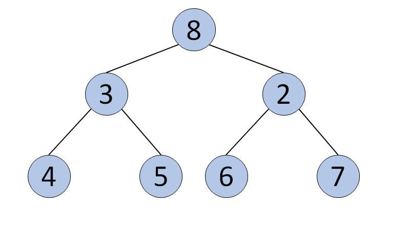
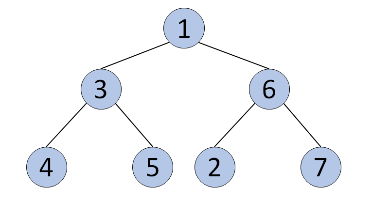
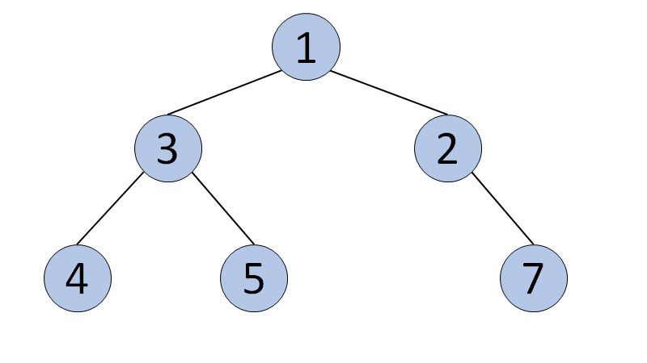
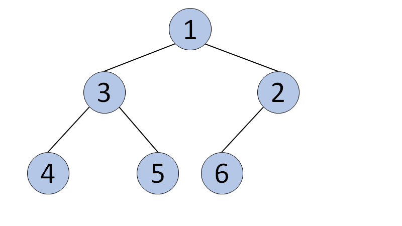

# Introduction

In many computer science applications, we only need to access the **largest** or **smallest** element in the dataset. We do not care about the order of other data in the data set. How do we efficiently access the largest or smallest element in the current dataset? The answer would be **Heap**.

In this Explore Card, we will introduce **Heap**. After reading this section, you will,

Have a better understanding of the “Heap” data structure and its implementation;

Have a better understanding of the concepts and methods of **Max Heap** and **Min Heap**;

Have a better understanding of **Heap Sort**;

Have a better understanding of the application scenarios of “Heap”;

Be able to use “Heap” in practice.

# Heap

## Definition and Classification of Heap

### Priority Queues

Before introducing a Heap, let's first talk about a Priority Queue.

[Wikipedia](https://en.wikipedia.org/wiki/Priority_queue): a priority queue is an [abstract data type](https://en.wikipedia.org/wiki/Abstract_data_type) similar to a regular [queue](https://en.wikipedia.org/wiki/Queue_(abstract_data_type)) or [stack](https://en.wikipedia.org/wiki/Stack_(abstract_data_type)) data structure in which each element additionally has a "priority" associated with it. In a priority queue, an element with high priority is served before an element with low priority.

In daily life, we would assign different priorities to tasks, start working on the task with the highest priority and then proceed to the task with the second highest priority. This is an example of a Priority Queue.

A common misconception is that a Heap is the same as a Priority Queue, which is not true. A priority queue is an abstract data type, while a Heap is a data structure. Therefore, a Heap is not a Priority Queue, but a way to implement a Priority Queue.

There are multiple ways to implement a Priority Queue, such as array and linked list. However, these implementations only guarantee $O(1)$ time complexity for either insertion or deletion, while the other operation will have a time complexity of $O(N)$. On the other hand, implementing the priority queue with Heap will allow both insertion and deletion to have a time complexity of $O(logN)$. So, what is a Heap?

In this chapter, we will learn to:

1. Understand the Heap data structure.
2. Understand Max Heap and Min Heap.
3. Understand the insertion and deletion of a Heap.
4. Implement a Heap.


### Definition of Heap

According to Wikipedia, a **Heap** is a special type of binary tree. A heap is a binary tree that meets the following criteria:

- Is a **complete binary tree**;
- The value of each node must be **no greater than (or no less than)** the value of its child nodes.

A Heap has the following properties:

- Insertion of an element into the Heap has a time complexity of $O(logN)$;
- Deletion of an element from the Heap has a time complexity of $O(logN)$;
- The maximum/minimum value in the Heap can be obtained with $O(1)$ time complexity.


### Classification of Heap

There are two kinds of heaps: **Max Heap** and **Min Heap**.

- Max Heap: Each node in the Heap has a value **no less than** its child nodes. Therefore, the top element (root node) has the **largest** value in the Heap.
- Min Heap: Each node in the Heap has a value **no larger than** its child nodes. Therefore, the top element (root node) has the **smallest** value in the Heap.


Diagram of a Min Heap and a Max Heap


## Heap Insertion

**Insertion** means adding an element to the Heap. After inserting the element, the properties of the Heap should remain unchanged.

### Heap Insertion Video

In the following video we will learn how to insert a node into a heap. We will discuss this operation separately for a min heap and a max heap.

~~~
<iframe src="https://player.vimeo.com/video/644478263?badge=0&amp;autopause=0&amp;player_id=0&amp;app_id=58479&amp;" frameborder="0" allow="autoplay; fullscreen; picture-in-picture" allowfullscreen="" title="Heap Insertion" style="box-sizing: border-box; position: absolute; top: 0px; left: 0px; width: 800px; height: 450px;"></iframe>
~~~

## Heap Deletion

**Deletion** means removing the “top” element from the Heap. After deleting the element, the property of Heap should remain unchanged.

### Heap Deletion Video

The following video will introduce the deletion operation in a heap. This operation will be discussed separately for a min heap and a max heap.

~~~
<iframe src="https://player.vimeo.com/video/631287349?badge=0&amp;autopause=0&amp;player_id=0&amp;app_id=58479&amp;" frameborder="0" allow="autoplay; fullscreen; picture-in-picture" allowfullscreen="" title="Heap Deletion" style="box-sizing: border-box; position: absolute; top: 0px; left: 0px; width: 800px; height: 450px;"></iframe>
~~~

## Implementation of a Heap

We often perform insertion, deletion, and getting the top element with a Heap data structure.

We can implement a Heap using an array. Elements in the Heap can be stored in the array in the form of a binary tree. The code below will implement “Max Heap” and “Min Heap” for integers (In LeetCode problems or daily work, we often will use existing libraries instead of manually implementing Heap).

#### Min Heap:

~~~
// Implementing "Min Heap"
public class MinHeap {
    // Create a complete binary tree using an array
    // Then use the binary tree to construct a Heap
    int[] minHeap;
    // the number of elements is needed when instantiating an array
    // heapSize records the size of the array
    int heapSize;
    // realSize records the number of elements in the Heap
    int realSize = 0;

    public MinHeap(int heapSize) {
        this.heapSize = heapSize;
        minHeap = new int[heapSize + 1];
        // To better track the indices of the binary tree, 
        // we will not use the 0-th element in the array
        // You can fill it with any value
        minHeap[0] = 0;
    }

    // Function to add an element
    public void add(int element) {
        realSize++;
        // If the number of elements in the Heap exceeds the preset heapSize
        // print "Added too many elements" and return
        if (realSize > heapSize) {
            System.out.println("Added too many elements!");
            realSize--;
            return;
        }
        // Add the element into the array
        minHeap[realSize] = element;
        // Index of the newly added element
        int index = realSize;
        // Parent node of the newly added element
        // Note if we use an array to represent the complete binary tree
        // and store the root node at index 1
        // index of the parent node of any node is [index of the node / 2]
        // index of the left child node is [index of the node * 2]
        // index of the right child node is [index of the node * 2 + 1]
        int parent = index / 2;
        // If the newly added element is smaller than its parent node,
        // its value will be exchanged with that of the parent node 
        while ( minHeap[index] < minHeap[parent] && index > 1 ) {
            int temp = minHeap[index];
            minHeap[index] = minHeap[parent];
            minHeap[parent] = temp;
            index = parent;
            parent = index / 2;
        }
    }

    // Get the top element of the Heap
    public int peek() {
        return minHeap[1];
    }

    // Delete the top element of the Heap
    public int pop() {
        // If the number of elements in the current Heap is 0,
        // print "Don't have any elements" and return a default value
        if (realSize < 1) {
            System.out.println("Don't have any element!");
            return Integer.MAX_VALUE;
        } else {
            // When there are still elements in the Heap
            // realSize >= 1
            int removeElement = minHeap[1];
            // Put the last element in the Heap to the top of Heap
            minHeap[1] = minHeap[realSize];
            realSize--;
            int index = 1;
            // When the deleted element is not a leaf node
            while (index <= realSize / 2) {
                // the left child of the deleted element
                int left = index * 2;
                // the right child of the deleted element
                int right = (index * 2) + 1;
                // If the deleted element is larger than the left or right child
                // its value needs to be exchanged with the smaller value
                // of the left and right child
                if (minHeap[index] > minHeap[left] || minHeap[index] > minHeap[right]) {
                    if (minHeap[left] < minHeap[right]) {
                        int temp = minHeap[left];
                        minHeap[left] = minHeap[index];
                        minHeap[index] = temp;
                        index = left;
                    } else {
                        // maxHeap[left] >= maxHeap[right]
                        int temp = minHeap[right];
                        minHeap[right] = minHeap[index];
                        minHeap[index] = temp;
                        index = right;
                    }
                } else {
                    break;
                }
            }
            return removeElement;
        } 
    }

    // return the number of elements in the Heap
    public int size() {
        return realSize;
    }

    public String toString() {
        if (realSize == 0) {
            return "No element!";
        } else {
            StringBuilder sb = new StringBuilder();
            sb.append('[');
            for (int i = 1; i <= realSize; i++) {
                sb.append(minHeap[i]);
                sb.append(',');
            }
            sb.deleteCharAt(sb.length() - 1);
            sb.append(']');
            return sb.toString();
        }
    }

    public static void main(String[] args) {
        // Test case
        MinHeap minHeap = new MinHeap(3);
        minHeap.add(3);
        minHeap.add(1);
        minHeap.add(2);
        // [1,3,2]
        System.out.println(minHeap.toString());
        // 1
        System.out.println(minHeap.peek());
        // 1
        System.out.println(minHeap.pop());
        // [2, 3]
        System.out.println(minHeap.toString());
        minHeap.add(4);
        // Add too many elements
        minHeap.add(5);
        // [2,3,4]
        System.out.println(minHeap.toString());
    }
}
~~~

### Complete Tree to Array Video

In the following video we will learn how to transform a binary tree into an array. During this process, we will discuss how to store a binary tree in an array, how to find the children/parents of a node when the tree is stored in an array, and how to determine if a node is a leaf node.

~~~
<iframe src="https://player.vimeo.com/video/632242457?badge=0&amp;autopause=0&amp;player_id=0&amp;app_id=58479&amp;" frameborder="0" allow="autoplay; fullscreen; picture-in-picture" allowfullscreen="" title="Complete Tree to Array" style="box-sizing: border-box; position: absolute; top: 0px; left: 0px; width: 800px; height: 450px;"></iframe>
~~~

# Exercise

Single Choice Question

Is the following tree a heap?

Yes

No

> This is a complete binary tree, and the value of each node is no larger than its child nodes, so it is a min heap.


------


Single Choice Question

Is the following tree a heap?

Yes

No

> Although this is a complete binary tree, it is not a Heap, because not all nodes have equal or larger (or equal or smaller) values than their child nodes. For instance, the node in the first row (8) is larger than its child nodes (3 and 2), while the left node in the second row (3) has a smaller value than its child nodes nodes (4 and 5).





------


Single Choice Question

Is the following tree a heap?

Yes

No

> Although this is a complete binary tree, it is not a Heap because not all nodes have equal or larger (or equal or smaller) values than their child nodes. Take the second row as an example; the node with value 3 is smaller than its child nodes, while the node with value 6 is larger than its left child.





------


Single Choice Question

Is the following tree a heap?

Yes

No

> Although all nodes have smaller values than their child nodes, it is not a complete binary tree.





------


Single Choice Question

Is the following tree a heap?

Yes

No

> This is a complete binary tree, and the value of each node is no larger than its child nodes, so it is a min heap.





------

# Common applications of Heap

## Common applications of Heap

In most programming languages, Heaps are already built-in. Therefore, we usually do not need to implement a Heap from scratch. However, to use Heap adequately, we need to understand how Heap is commonly used.

In this chapter, we will learn how to:

- Construct a Max Heap and a Min Heap.
- Insert elements into a Heap.
- Get the top element of a Heap.
- Delete the top element from a Heap.
- Get the length of a Heap.
- Perform time and space complexity analysis for common applications that use a Heap.

## Construct a Heap

Constructing a Heap means initializing an instance of a Heap. All methods of Heap need to be performed on an instance. Therefore, we need to initialize an instance before applying the methods. When creating a Heap, we can simultaneously perform the **heapify** operation. Heapify means converting a group of data into a Heap.

Time complexity: $O(N)$.

Space complexity: $O(N)$.

~~~java
// In Java, a Heap is represented by a Priority Queue
import java.util.Collections;
import java.util.PriorityQueue;
import java.util.Arrays;

// Construct an empty Min Heap
PriorityQueue<Integer> minHeap = new PriorityQueue<>();

// Construct an empty Max Heap
PriorityQueue<Integer> maxHeap = new PriorityQueue<>(Collections.reverseOrder());

// Construct a Heap with initial elements. 
// This process is named "Heapify".
// The Heap is a Min Heap
PriorityQueue<Integer> heapWithValues= new PriorityQueue<>(Arrays.asList(3, 1, 2));
~~~

## Inserting an Element

Insertion means inserting a new element into the Heap. Note that, after the new element is inserted, properties of the Heap are still maintained.

Time complexity: $O(logN)$

Space complexity: $O(1)$

~~~java
// Insert an element to the Min Heap
minHeap.add(5);

// Insert an element to the Max Heap
maxHeap.add(5);
~~~

## Getting the Top Element of the Heap

The top element of a Max heap is the maximum value in the Heap, while the top element of a Min Heap is the smallest value in the Heap. The top element of the Heap is the most important element in the Heap.

Time complexity: $O(1)$.

Space complexity: $O(1)$.

~~~java
// Get top element from the Min Heap
// i.e. the smallest element
minHeap.peek();
// Get top element from the Max Heap
// i.e. the largest element
maxHeap.peek();
~~~

## Deleting the top element

Note that, after deleting the top element, the properties of the Heap will still hold. Therefore, the new top element in the Heap will be the maximum (for Max Heap) or minimum (for Min Heap) of the current Heap.

Time complexity: $O(logN)$.

Space complexity: $O(1)$.

~~~java
// Delete top element from the Min Heap
minHeap.poll();

// Delete top element from the Max Heap
maxheap.poll();
~~~

## Getting the Length of a Heap

The length of the Heap can be used to determine the size of the current heap, and it can also be used to determine if the current Heap is empty. If there are no elements in the current Heap, the length of the Heap is zero.

Time complexity: $O(1)$

Space complexity: $O(1)$

~~~java
// Length of the Min Heap
minHeap.size();

// Length of the Max Heap
maxHeap.size();

// Note, in Java, apart from checking if the length of the Heap is 0, we can also use isEmpty()
// If there are no elements in the Heap, isEmpty() will return true;
// If there are still elements in the Heap, isEmpty() will return false;
~~~

## Space and Time Complexity

| Heap method            | Time complexity      | Space complexity |
| ---------------------- | -------------------- | ---------------- |
| Construct a Heap       | $O(N)$         | $O(N)$     |
| Insert an element      | $O(logN)$ | $O(1)$       |
| Get the top element    | $O(1)$           | $O(1)$       |
| Delete the top element | $O(logN)$ | $O(1)$       |
| Get the size of a Heap | $O(1)$           | $O(1)$       |

\small {N} \small \text { is the number of elements in the heap.}*N* is the number of elements in the heap.


### Time and Space Complexity Video

The following video will analyze the time and space complexity of each of the common operations of a heap. This includes creating a heap, inserting an element into a heap, getting the top element, removing the top element, and getting the size of the heap.

~~~
<iframe src="https://player.vimeo.com/video/632242894?badge=0&amp;autopause=0&amp;player_id=0&amp;app_id=58479&amp;" frameborder="0" allow="autoplay; fullscreen; picture-in-picture" allowfullscreen="" title="Time and Space Complexity" style="box-sizing: border-box; position: absolute; top: 0px; left: 0px; width: 800px; height: 450px;"></iframe>
~~~

## Complete Code

Listed below is the code for common methods of Heap. We strongly suggest that you type line by line into your text editor, run these methods and understand the underlying logic flow of each method.

#### Min Heap:

~~~java
// Code for Min Heap
import java.util.PriorityQueue;

public class App {
    public static void main(String[] args) {
        // Construct an instance of Min Heap
        PriorityQueue<Integer> minHeap = new PriorityQueue<>();
        
        // Add 3，1，2 respectively to the Min Heap
        minHeap.add(3);
        minHeap.add(1);
        minHeap.add(2);
        
        // Check all elements in the Min Heap, the result is [1, 3, 2]
        System.out.println("minHeap: " + minHeap.toString());
        
        // Get the top element of the Min Heap
        int peekNum = minHeap.peek();
        
        // The result is 1
        System.out.println("peek number: " + peekNum);
        
        // Delete the top element in the Min Heap
        int pollNum = minHeap.poll();
        
        // The reult is 1
        System.out.println("poll number: " + pollNum);
        
        // Check the top element after deleting 1, the result is 2
        System.out.println("peek number: " + minHeap.peek());
        
        // Check all elements in the Min Heap, the result is [2,3]
        System.out.println("minHeap: " + minHeap.toString());
        
        // Check the number of elements in the Min Heap
        // Which is also the length of the Min Heap
        int heapSize = minHeap.size();
        
        // The result is 2
        System.out.println("minHeap size: " + heapSize);
        
        // Check if the Min Heap is empty
        boolean isEmpty = minHeap.isEmpty();
        
        // The result is false
        System.out.println("isEmpty: " + isEmpty);
    }
}
~~~

#### Max Heap:

~~~java
// Code for Max Heap
import java.util.Collections;
import java.util.PriorityQueue;

public class App {
    public static void main(String[] args) {
        // Construct an instance of Max Heap
        PriorityQueue<Integer> maxHeap = new PriorityQueue<>(Collections.reverseOrder());
        
        // Add 1，3，2 respectively to the Max Heap
        maxHeap.add(1);
        maxHeap.add(3);
        maxHeap.add(2);
        
        // Check all elements in the Max Heap, the result is [3, 1, 2]
        System.out.println("maxHeap: " + maxHeap.toString());
        
        // Get the top element of the Max Heap
        int peekNum = maxHeap.peek();
        
        // The result is 3
        System.out.println("peek number: " + peekNum);
        
        // Delete the top element in the Max Heap
        int pollNum = maxHeap.poll();
        
        // The reult is 3
        System.out.println("poll number: " + pollNum);
        
        // Check the top element after deleting 3, the result is 2
        System.out.println("peek number: " + maxHeap.peek());
        
        // Check all elements in the Max Heap, the result is [2,1]
        System.out.println("maxHeap: " + maxHeap.toString());
        
        // Check the number of elements in the Max Heap
        // Which is also the length of the Max Heap
        int heapSize = maxHeap.size();
        
        // The result is 2
        System.out.println("maxHeap size: " + heapSize);
        
        // Check if the Max Heap is empty
        boolean isEmpty = maxHeap.isEmpty();
        
        // The result is false
        System.out.println("isEmpty: " + isEmpty);
    }
}
~~~

# Application of Heap

## Application of Heap

**Heap** is a commonly used data structure in computer science. In this chapter, we will cover several applications of Heap.

1. Heap Sort
2. The Top-K problem
3. The K-th element

## Heap Sort

**Heap Sort** sorts a group of unordered elements using the Heap data structure.

The sorting algorithm using a **Min Heap** is as follows:

1. Heapify all elements into a Min Heap.
2. Record and delete the top element.
3. Put the top element into an array T that stores all sorted elements. Now, the Heap will remain a Min Heap.
4. Repeat steps 2 and 3 until the Heap is empty. The array T will contain all elements sorted in ascending order.

The sorting algorithm using a **Max Heap** is as follows:

1. Heapify all elements into a Max Heap.
2. Record and delete the top element.
3. Put the top element into an array T that stores all sorted elements. Now, the Heap will remain a Max Heap.
4. Repeat steps 2 and 3 until the Heap is empty. The array T will contain all elements sorted in descending order.

**Complexity Analysis:**

Let $N$ be the total number of elements.

Time complexity: $O(NlogN)$

Space complexity: $O(N)$

### Heap Sort Video

Using a heap to obtain a sorted array involves converting the unsorted array into a heap, then popping the elements from the heap one at a time and adding them to the new sorted array. The following video will walk through this process step by step for a Min Heap to obtain an array sorted in ascending order. The process for a Max Heap would be the same, except that the sorted array would be in descending order.

~~~
<iframe src="https://player.vimeo.com/video/633090232?badge=0&amp;autopause=0&amp;player_id=0&amp;app_id=58479&amp;" frameborder="0" allow="autoplay; fullscreen; picture-in-picture" allowfullscreen="" title="Heap Sort" style="box-sizing: border-box; position: absolute; top: 0px; left: 0px; width: 800px; height: 450px;"></iframe>
~~~

## The Top K Problem

### The Top K Problem - Approach 1

Use the Heap data structure to obtain Top K’s largest or smallest elements.

Solution of the Top K largest elements:

1. Construct a Max Heap.
2. Add all elements into the Max Heap.
3. Traversing and deleting the top element (using pop() or poll() for instance), and store the value into the result array T.
4. Repeat step 3 until we have removed the K largest elements.

Solution of the Top K smallest elements:

1. Construct a Min Heap.
2. Add all elements into the Min Heap.
3. Traversing and deleting the top element (using pop() or poll() for instance), and store the value into the result array T.
4. Repeat step 3 until we have removed the K smallest elements.

**Complexity Analysis:**

Time complexity: $O(KlogN+N)$

- Steps one and two require us to construct a Max Heap which requires $O(N)$ time using the previously discussed heapify method. Each element removed from the heap requires $O(logN)$ time; this process is repeated $K$ times. Thus the total time complexity is $O(KlogN+N)$.

Space complexity: $O(N)$

- After step 2, the heap will store all $N$ elements.

------
~~~
<iframe src="https://player.vimeo.com/video/633089684?badge=0&amp;autopause=0&amp;player_id=0&amp;app_id=58479&amp;" frameborder="0" allow="autoplay; fullscreen; picture-in-picture" allowfullscreen="" title="Top K Problem Approach 1" style="box-sizing: border-box; position: absolute; top: 0px; left: 0px; width: 800px; height: 450px;"></iframe>
~~~

------

### The Top K Problem - Approach 2

Use the **Heap** data structure to obtain Top K’s largest or smallest elements.

Solution of the Top K largest elements:

1. Construct a Min Heap with size K.
2. Add elements to the Min Heap one by one.
3. When there are K elements in the “Min Heap”, compare the current element with the top element of the Heap:
4. If the current element is no larger than the top element of the Heap, drop it and - proceed to the next element.
5. If the current element is larger than the Heap’s top element, delete the Heap’s top element, and add the current element to the Min Heap.
6. Repeat Steps 2 and 3 until all elements have been iterated.

Now the K elements in the Min Heap are the K largest elements.

Solution of the Top K smallest elements:

1. Construct a Max Heap with size K.
2. Add elements to the Max Heap one by one.
3. When there are K elements in the “Max Heap”, compare the current element with the top element of the Heap:
4. If the current element is no smaller than the top element of the Heap, drop it and proceed to the next element.
5. If the current element is smaller than the top element of the Heap, delete the top element of the Heap, and add the current element to the Max Heap.
6. Repeat Steps 2 and 3 until all elements have been iterated.

Now the K elements in the Max Heap are the K smallest elements.

**Complexity Analysis:**

Time complexity: $O(NlogK)$

- Steps one and two will require $O(KlogK)$ time if the elements are added one by one to the heap, however using the heapify method, these two steps could be accomplished in $O(K)$ time. Steps 3 and 4 will require $O(logK)$ time each time an element must be replaced in the heap. In the worst-case scenario, this will be done N - K*N*−*K* times. Thus the total time complexity is $O((N−K)logK+KlogK)$ which simplifies to $O(NlogK)$.

Space complexity: $O(K)$

- The heap will contain at most $K$ elements at any given time.

------
~~~
<iframe src="https://player.vimeo.com/video/633234403?badge=0&amp;autopause=0&amp;player_id=0&amp;app_id=58479&amp;" frameborder="0" allow="autoplay; fullscreen; picture-in-picture" allowfullscreen="" title="Top K Problem Approach 2" style="box-sizing: border-box; position: absolute; top: 0px; left: 0px; width: 800px; height: 450px;"></iframe>
~~~

## The K-th Element

### The K-th Element - Approach 1

Use the Heap data structure to obtain the K-th largest or smallest element.

Solution of the K-th largest element:

1. Construct a Max Heap.
2. Add all elements into the Max Heap.
3. Traversing and deleting the top element (using pop() or poll() for instance).
4. Repeat Step 3 K times until we find the K-th largest element.

Solution of the K-th smallest element:

1. Construct a Min Heap.
2. Add all elements into the Min Heap.
3. Traversing and deleting the top element (using pop() or poll() for instance).
4. Repeat Step 3 K times until we find the K-th smallest element.

**Complexity Analysis:**

Let $N$ be the total number of elements.

Time complexity: $O(KlogN+N)$

- Steps one and two require us to construct a Max Heap which requires $O(N)$ time using the previously discussed heapify method. Each element removed from the heap requires $O(logN)$ time; this process is repeated $K$ times. Thus the total time complexity is $O(KlogN+N)$.

Space complexity: $O(N)$

- After step 2, the heap will store all $N$ elements.

------
~~~
<iframe src="https://player.vimeo.com/video/633090336?badge=0&amp;autopause=0&amp;player_id=0&amp;app_id=58479&amp;" frameborder="0" allow="autoplay; fullscreen; picture-in-picture" allowfullscreen="" title="Kth Element Problem Approach 1" style="box-sizing: border-box; position: absolute; top: 0px; left: 0px; width: 800px; height: 450px;"></iframe>
~~~

------

### The K-th Element - Approach 2

Use the **Heap** data structure to obtain the K-th largest or smallest element.

Solution of the K-th largest element:

1. Construct a Min Heap with size K.
2. Add elements to the Min Heap one by one.
3. When there are K elements in the “Min Heap”, compare the current element with the top element of the Heap:
   - If the current element is not larger than the top element of the Heap, drop it and proceed to the next element.
   - If the current element is larger than the Heap’s top element, delete the Heap’s top element, and add the current element to the “Min Heap”.
4. Repeat Steps 2 and 3 until all elements have been iterated.

Now the top element in the Min Heap is the K-th largest element.

Solution of the K-th smallest element:

1. Construct a Max Heap with size K.
2. Add elements to the Max Heap one by one.
3. When there are K elements in the Max Heap, compare the current element with the top element of the Heap:
   - If the current element is not smaller than the top element of the Heap, drop it and proceed to the next element;
   - If the current element is smaller than the top element of the Heap, delete the top element of the Heap, and add the current element to the Max Heap.
4. Repeat Steps 2 and 3 until all elements have been iterated. Now the top element in the Max Heap is the K smallest element.

**Complexity Analysis:**

Time complexity: $O(NlogK)$

- Steps one and two will require $O(KlogK)$ time if the elements are added one by one to the heap, however using the heapify method, these two steps could be accomplished in $O(K)$ time. Steps 3 and 4 will require $O(logK)$ time each time an element must be replaced in the heap. In the worst-case scenario, this will be done N - K*N*−*K* times. Thus the total time complexity is $O((N−K)logK+KlogK)$ which simplifies to $O(NlogK)$.

Space complexity: $O(K)$

- The heap will contain at most $K$ elements at any given time.

------
~~~
<iframe src="https://player.vimeo.com/video/633090491?badge=0&amp;autopause=0&amp;player_id=0&amp;app_id=58479&amp;" frameborder="0" allow="autoplay; fullscreen; picture-in-picture" allowfullscreen="" title="Kth Element Problem Approach 2" style="box-sizing: border-box; position: absolute; top: 0px; left: 0px; width: 800px; height: 450px;"></iframe>
~~~

# Practices

## Coding Question - Kth Largest Element in an Array

Given an integer array `nums` and an integer `k`, return *the* `kth` *largest element in the array*.

Note that it is the `kth` largest element in the sorted order, not the `kth` distinct element.

 

**Example 1:**

```
Input: nums = [3,2,1,5,6,4], k = 2
Output: 5
```

**Example 2:**

```
Input: nums = [3,2,3,1,2,4,5,5,6], k = 4
Output: 4
```

 

**Constraints:**

- `1 <= k <= nums.length <= 104`
- `-104 <= nums[i] <= 104`

~~~
class Solution {
    public int findKthLargest(int[] nums, int k) {
        
    }
}
~~~


## Coding Question - Top K Frequent Elements

Given an integer array `nums` and an integer `k`, return *the* `k` *most frequent elements*. You may return the answer in **any order**.

 

**Example 1:**

```
Input: nums = [1,1,1,2,2,3], k = 2
Output: [1,2]
```

**Example 2:**

```
Input: nums = [1], k = 1
Output: [1]
```

 

**Constraints:**

- `1 <= nums.length <= 105`
- `k` is in the range `[1, the number of unique elements in the array]`.
- It is **guaranteed** that the answer is **unique**.

 

**Follow up:** Your algorithm's time complexity must be better than `O(n log n)`, where n is the array's size.

~~~
class Solution {
    public int[] topKFrequent(int[] nums, int k) {
        
    }
}
~~~


## Coding Question - Kth Largest Element in a Stream

Design a class to find the `kth` largest element in a stream. Note that it is the `kth` largest element in the sorted order, not the `kth` distinct element.

Implement `KthLargest` class:

- `KthLargest(int k, int[] nums)` Initializes the object with the integer `k` and the stream of integers `nums`.
- `int add(int val)` Appends the integer `val` to the stream and returns the element representing the `kth` largest element in the stream.

 

**Example 1:**

```
Input
["KthLargest", "add", "add", "add", "add", "add"]
[[3, [4, 5, 8, 2]], [3], [5], [10], [9], [4]]
Output
[null, 4, 5, 5, 8, 8]

Explanation
KthLargest kthLargest = new KthLargest(3, [4, 5, 8, 2]);
kthLargest.add(3);   // return 4
kthLargest.add(5);   // return 5
kthLargest.add(10);  // return 5
kthLargest.add(9);   // return 8
kthLargest.add(4);   // return 8
```

 

**Constraints:**

- `1 <= k <= 104`
- `0 <= nums.length <= 104`
- `-104 <= nums[i] <= 104`
- `-104 <= val <= 104`
- At most `104` calls will be made to `add`.
- It is guaranteed that there will be at least `k` elements in the array when you search for the `kth` element.

~~~
class KthLargest {

    public KthLargest(int k, int[] nums) {
        
    }
    
    public int add(int val) {
        
    }
}

/**
 * Your KthLargest object will be instantiated and called as such:
 * KthLargest obj = new KthLargest(k, nums);
 * int param_1 = obj.add(val);
 */
~~~


## Coding Question - Last Stone Weight

You are given an array of integers `stones` where `stones[i]` is the weight of the `ith` stone.

We are playing a game with the stones. On each turn, we choose the **heaviest two stones** and smash them together. Suppose the heaviest two stones have weights `x` and `y` with `x <= y`. The result of this smash is:

- If `x == y`, both stones are destroyed, and
- If `x != y`, the stone of weight `x` is destroyed, and the stone of weight `y` has new weight `y - x`.

At the end of the game, there is **at most one** stone left.

Return *the smallest possible weight of the left stone*. If there are no stones left, return `0`.

 

**Example 1:**

```
Input: stones = [2,7,4,1,8,1]
Output: 1
Explanation: 
We combine 7 and 8 to get 1 so the array converts to [2,4,1,1,1] then,
we combine 2 and 4 to get 2 so the array converts to [2,1,1,1] then,
we combine 2 and 1 to get 1 so the array converts to [1,1,1] then,
we combine 1 and 1 to get 0 so the array converts to [1] then that's the value of the last stone.
```

**Example 2:**

```
Input: stones = [1]
Output: 1
```

 

**Constraints:**

- `1 <= stones.length <= 30`
- `1 <= stones[i] <= 1000`


  **Hide Hint #1**

Simulate the process. We can do it with a heap, or by sorting some list of stones every time we take a turn.

~~~
class Solution {
    public int lastStoneWeight(int[] stones) {
        
    }
}
~~~


## Coding Question - The K Weakest Rows in a Matrix

You are given an `m x n` binary matrix `mat` of `1`'s (representing soldiers) and `0`'s (representing civilians). The soldiers are positioned **in front** of the civilians. That is, all the `1`'s will appear to the **left** of all the `0`'s in each row.

A row `i` is **weaker** than a row `j` if one of the following is true:

- The number of soldiers in row `i` is less than the number of soldiers in row `j`.
- Both rows have the same number of soldiers and `i < j`.

Return *the indices of the* `k` ***weakest** rows in the matrix ordered from weakest to strongest*.

 

**Example 1:**

```
Input: mat = 
[[1,1,0,0,0],
 [1,1,1,1,0],
 [1,0,0,0,0],
 [1,1,0,0,0],
 [1,1,1,1,1]], 
k = 3
Output: [2,0,3]
Explanation: 
The number of soldiers in each row is: 
- Row 0: 2 
- Row 1: 4 
- Row 2: 1 
- Row 3: 2 
- Row 4: 5 
The rows ordered from weakest to strongest are [2,0,3,1,4].
```

**Example 2:**

```
Input: mat = 
[[1,0,0,0],
 [1,1,1,1],
 [1,0,0,0],
 [1,0,0,0]], 
k = 2
Output: [0,2]
Explanation: 
The number of soldiers in each row is: 
- Row 0: 1 
- Row 1: 4 
- Row 2: 1 
- Row 3: 1 
The rows ordered from weakest to strongest are [0,2,3,1].
```

 

**Constraints:**

- `m == mat.length`
- `n == mat[i].length`
- `2 <= n, m <= 100`
- `1 <= k <= m`
- `matrix[i][j]` is either 0 or 1.


  **Hide Hint #1 **

Sort the matrix row indexes by the number of soldiers and then row indexes.

~~~
class Solution {
    public int[] kWeakestRows(int[][] mat, int k) {
        
    }
}
~~~


## Coding Question - Kth Smallest Element in a Sorted Matrix

Given an `n x n` `matrix` where each of the rows and columns is sorted in ascending order, return *the* `kth` *smallest element in the matrix*.

Note that it is the `kth` smallest element **in the sorted order**, not the `kth` **distinct** element.

You must find a solution with a memory complexity better than `O(n2)`.

 

**Example 1:**

```
Input: matrix = [[1,5,9],[10,11,13],[12,13,15]], k = 8
Output: 13
Explanation: The elements in the matrix are [1,5,9,10,11,12,13,13,15], and the 8th smallest number is 13
```

**Example 2:**

```
Input: matrix = [[-5]], k = 1
Output: -5
```

 

**Constraints:**

- `n == matrix.length == matrix[i].length`
- `1 <= n <= 300`
- `-109 <= matrix[i][j] <= 109`
- All the rows and columns of `matrix` are **guaranteed** to be sorted in **non-decreasing order**.
- `1 <= k <= n2`

 

**Follow up:**

- Could you solve the problem with a constant memory (i.e., `O(1)` memory complexity)?
- Could you solve the problem in `O(n)` time complexity? The solution may be too advanced for an interview but you may find reading [this paper](http://www.cse.yorku.ca/~andy/pubs/X+Y.pdf) fun.

~~~
class Solution {
    public int kthSmallest(int[][] matrix, int k) {
        
    }
}
~~~


## Coding Question - Meeting Room

Locked

## Coding Question - K Closest Points to Origin

Given an array of `points` where `points[i] = [xi, yi]` represents a point on the **X-Y** plane and an integer `k`, return the `k` closest points to the origin `(0, 0)`.

The distance between two points on the **X-Y** plane is the Euclidean distance (i.e., `√(x1 - x2)2 + (y1 - y2)2`).

You may return the answer in **any order**. The answer is **guaranteed** to be **unique** (except for the order that it is in).

 

**Example 1:**


```
Input: points = [[1,3],[-2,2]], k = 1
Output: [[-2,2]]
Explanation:
The distance between (1, 3) and the origin is sqrt(10).
The distance between (-2, 2) and the origin is sqrt(8).
Since sqrt(8) < sqrt(10), (-2, 2) is closer to the origin.
We only want the closest k = 1 points from the origin, so the answer is just [[-2,2]].
```

**Example 2:**

```
Input: points = [[3,3],[5,-1],[-2,4]], k = 2
Output: [[3,3],[-2,4]]
Explanation: The answer [[-2,4],[3,3]] would also be accepted.
```

 

**Constraints:**

- `1 <= k <= points.length <= 104`
- `-104 < xi, yi < 104`

~~~
class Solution {
    public int[][] kClosest(int[][] points, int k) {
        
    }
}
~~~


## Coding Question - Minimum Cost to connect

Locked

## Coding Question - Furthest Building You Can Reach

You are given an integer array `heights` representing the heights of buildings, some `bricks`, and some `ladders`.

You start your journey from building `0` and move to the next building by possibly using bricks or ladders.

While moving from building `i` to building `i+1` (**0-indexed**),

- If the current building's height is **greater than or equal** to the next building's height, you do **not** need a ladder or bricks.
- If the current building's height is **less than** the next building's height, you can either use **one ladder** or `(h[i+1] - h[i])` **bricks**.

*Return the furthest building index (0-indexed) you can reach if you use the given ladders and bricks optimally.*

 

**Example 1:**


```
Input: heights = [4,2,7,6,9,14,12], bricks = 5, ladders = 1
Output: 4
Explanation: Starting at building 0, you can follow these steps:
- Go to building 1 without using ladders nor bricks since 4 >= 2.
- Go to building 2 using 5 bricks. You must use either bricks or ladders because 2 < 7.
- Go to building 3 without using ladders nor bricks since 7 >= 6.
- Go to building 4 using your only ladder. You must use either bricks or ladders because 6 < 9.
It is impossible to go beyond building 4 because you do not have any more bricks or ladders.
```

**Example 2:**

```
Input: heights = [4,12,2,7,3,18,20,3,19], bricks = 10, ladders = 2
Output: 7
```

**Example 3:**

```
Input: heights = [14,3,19,3], bricks = 17, ladders = 0
Output: 3
```

 

**Constraints:**

- `1 <= heights.length <= 105`
- `1 <= heights[i] <= 106`
- `0 <= bricks <= 109`
- `0 <= ladders <= heights.length`


- `0 <= ladders <= heights.length`

  **Hide Hint #1 **

Assume the problem is to check whether you can reach the last building or not.

  **Hide Hint #2 **

You'll have to do a set of jumps, and choose for each one whether to do it using a ladder or bricks. It's always optimal to use ladders in the largest jumps.

  **Hide Hint #3 **

Iterate on the buildings, maintaining the largest r jumps and the sum of the remaining ones so far, and stop whenever this sum exceeds b.

~~~
class Solution {
    public int furthestBuilding(int[] heights, int bricks, int ladders) {
        
    }
}
~~~


## Coding Question - Find Median from Data Stream

The **median** is the middle value in an ordered integer list. If the size of the list is even, there is no middle value and the median is the mean of the two middle values.

- For example, for `arr = [2,3,4]`, the median is `3`.
- For example, for `arr = [2,3]`, the median is `(2 + 3) / 2 = 2.5`.

Implement the MedianFinder class:

- `MedianFinder()` initializes the `MedianFinder` object.
- `void addNum(int num)` adds the integer `num` from the data stream to the data structure.
- `double findMedian()` returns the median of all elements so far. Answers within `10-5` of the actual answer will be accepted.

 

**Example 1:**

```
Input
["MedianFinder", "addNum", "addNum", "findMedian", "addNum", "findMedian"]
[[], [1], [2], [], [3], []]
Output
[null, null, null, 1.5, null, 2.0]

Explanation
MedianFinder medianFinder = new MedianFinder();
medianFinder.addNum(1);    // arr = [1]
medianFinder.addNum(2);    // arr = [1, 2]
medianFinder.findMedian(); // return 1.5 (i.e., (1 + 2) / 2)
medianFinder.addNum(3);    // arr[1, 2, 3]
medianFinder.findMedian(); // return 2.0
```

 

**Constraints:**

- `-105 <= num <= 105`
- There will be at least one element in the data structure before calling `findMedian`.
- At most `5 * 104` calls will be made to `addNum` and `findMedian`.

 

**Follow up:**

- If all integer numbers from the stream are in the range `[0, 100]`, how would you optimize your solution?
- If `99%` of all integer numbers from the stream are in the range `[0, 100]`, how would you optimize your solution?

~~~
class MedianFinder {

    public MedianFinder() {
        
    }
    
    public void addNum(int num) {
        
    }
    
    public double findMedian() {
        
    }
}

/**
 * Your MedianFinder object will be instantiated and called as such:
 * MedianFinder obj = new MedianFinder();
 * obj.addNum(num);
 * double param_2 = obj.findMedian();
 */
~~~

