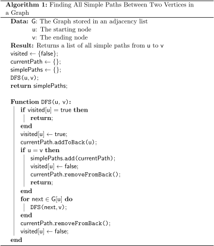
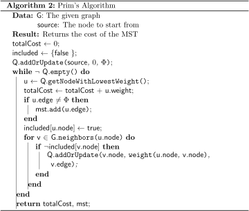
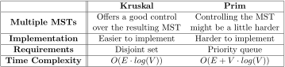

# Notes

##  DFS vs BFS

A question that most likely came to mind when you were reading about DFS and BFS was:

> "What's the practical difference?"

The theory is clear; BFS first visits the nodes closest to our starting node while DFS goes as deep into the graph (as far away from our starting node) as possible before continuing with other nodes close to our starting node.

Let's go through some examples:

- If all you want to do is check whether two nodes are connected at all in a graph that doesn't give you a clear reason to prefer one or the other of the graph traversal algorithms - **either one**
- If you "know" that your two nodes are close to each other if they're connected at all - for example looking for family members in an acquaintance graph - use **BFS**
- If you want to count all the possible ways to get from one node to another - **DFS**
- If you want the shortest path (the path that goes through the fewest number of nodes) from one node to another - **BFS**
- **DFS** can also be used for some slightly advanced things, like detecting a cycle in a graph, or for checking for **strongly connected components** (a mathematical term that means "that every node is reachable from every other node") which can later be used for solving 2-satisfiability problems (2-SAT).


## In this article we will be discussing about five ways of detecting cycle in a graph:

1. Using **Topological Sort** for **Directed Graph**: If the graph **does not** have a topological sort then the graph definitely contains one or more cycles. We have an entire chapter on this. Please see the chapter "[Topological Sort: DFS, BFS and DAG](https://www.thealgorists.com/Algo/TopologicalSort)".

   

2. Using **BFS** for **Undirected Graph**: If you see a **cross-edge**, there is a cycle.

   You can still use **BFS** to detect cycle in a **Directed Graph**, but in that case you also have to use Topological Sorting along with BFS. Please refer to the *Topological Sort by BFS* section of the article "[Topological Sort: DFS, BFS and DAG](https://www.thealgorists.com/Algo/TopologicalSort)".

   In this approach you won't need to find *cross-edge* in this approach. Here you try your best to build a topological ordering for whichever vertices possible in the graph, and then at last you check if the topological ordering contains all the vertices in the graph. If there cycles in the graph the vertices participating in the cycle(s) will not be present in the topological sort, resulting in the size of the list of vertices present in the topological sort less than the total number of vertices present in the graph. If (number of vertices present in the topological ordering) != total number of vertices present in the graph, then that indicates that there is **at least one cycle present in the graph**, because if there were no cycle present in the graph then the topological sort would contain all the vertices of the graph.

   

3. Using **DFS** for **both Directed and Undirected Graph**: A back-edge determines a cycle. Read the chapter "[Cycle Detection Using DFS](https://www.thealgorists.com/Algo/CycleDetectionUsingDFS)" to know more about this.

   

4. Using

    

   **Union-Find**

    

   and

    

   **Kruskal’s Algorithm**

    

   for

    

   both Directed and Undirected Graph:

   Kruskal’s algorithm is all about

    

   avoiding cycles in a graph

   . It uses

   Union-Find

   technique for doing that. You can use the same for detecting cycles in a graph.

   You start building a spanning tree starting with an empty set of edges and picking one edge at random. If the both the vertices of a new unvisited edge that you are visiting happens to belong to the same component then you have a cycle.

   The algorithm should look like below:

   ```java
   for each unvisited edge (u, v) in E
   {
       if(Find(u) = Find(v)) // u and v belong to the same set already
       {
           print "Cycle Detected";
           break;
       } else {
           Union(u, v); // put u and v in the same set
       }
   }
   ```

   How Would You Know What Kind of Edge You Are Dealing With?

   Here’s the trick:

   Let’s consider an edge X-Y.

   Back Edge: If discovered(y) == true and processed(y) == false, then X-Y is a Back Edge.

   In this case, node Y has been discovered and is in visiting state but has not been fully processed. So node X happens to be one of the descendents of Y. A edge coming back in from a descendent is definitely a Back Edge.

   Forward Edge: If

   \1. processed(y) == true, and

   \2. entryTime(x) < entryTime(y)

   then X-Y is a Forward Edge.

   Cross Edge: If

   \1. processed(y) == true,

   \2. entryTime(y) < entryTime(x)

   then X-Y is a Cross Edge.

   ### Kruskal’s Algorithm:

   Those who already remember ins and outs of Kruskal’s Algorithm can skip the rest of this article. Those who need to brush up Kruskal’s Algorithm go on reading till the last.

   Kruskal’s Algorithm is a Greedy Approach to construct a Minimum Spanning Tree, in which edges are considered in nondecreasing order of cost. This interpretation is that the set t of edges so far selected for the spanning tree be such that it is possible to complete t into a tree.Thus t may not be a tree at all stages in the algorithm. In fact, it will generally only be a forest since the set of edges t can be completed into a tree iff there are NO cycles in t.

   Let’s go over the pseudocode now:

   ```java
   Algorithm Kruskal(E, cost, n, t)
   // E is the set of edges in G. G has n vertices, cost[u, v] is the
   // cost of edge (u, v). t is the set of edges in the minimum-cost
   // spanning tree. An array consisting of all the edges of the
   // minimum-cost spanning tree is returned.
   {
       Construct a min-heap out of the edge costs either
       using Heapify or PriorityQueue API in Java.
   
       // Each vertex should be in its own set initially
       for i := 1 to n do
           parent[i] := -1;
   
       Take an array Arr of size E to return the edges of the spanning tree;
   
       i := 0, mincost := 0.0;
   
       while ((i < n - 1) and (heap not empty)) do
       {
           Delete a minimum cost edge (u, v) from the heap and reheapify;
   
           j := Find(u);
           k := Find(v);
   
           // Make sure including the edge U-V in the set doesn't
           // introduce a cycle.
           if (j != k) then
           {
               i := i + 1;
               t[i, 1] := u;
               t[i, 2] := v;
               Union(j, k);
               mincost := mincost + cost[u, v];
               Put edge U-V in Arr;
           }
       }
       if (i != n - 1) then write ("No Spanning Tree");
       else return Arr;
   }
   ```

   In more simplified form:

   ```java
   t is an empty set;
   while ((t has less than n - 1 edges) and (E is not empty)) do
   {
       Choose an edge u-v from E of lowest cost;
       Delete edge u-v from E;
       if u-v does NOT create a cycle in t then add u-v to t;
       else discard u-v;
   }
   ```

## Find All Simple Paths Between Two Vertices in a Graph

https://www.baeldung.com/cs/simple-paths-between-two-vertices




## Kruskal’s vs Prim’s Algorithm

https://www.baeldung.com/cs/kruskals-vs-prims-algorithm#minimum-spanning-tree







